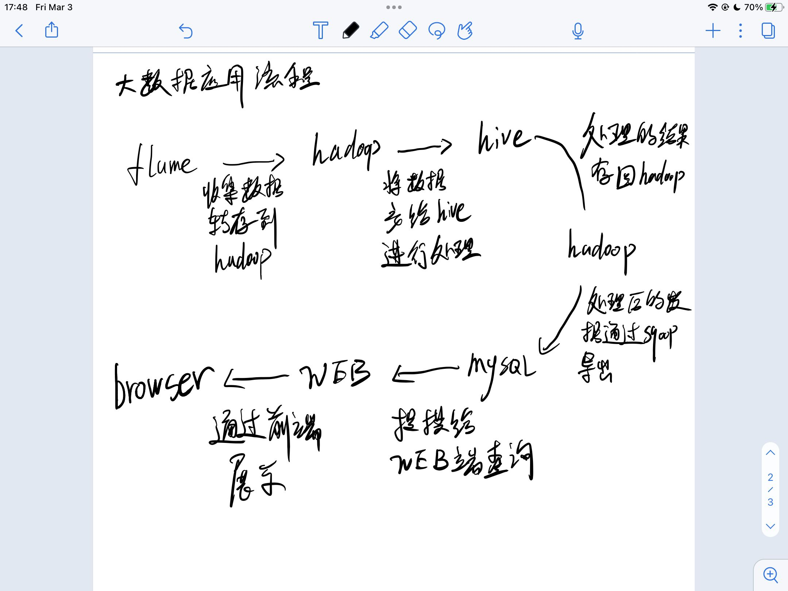
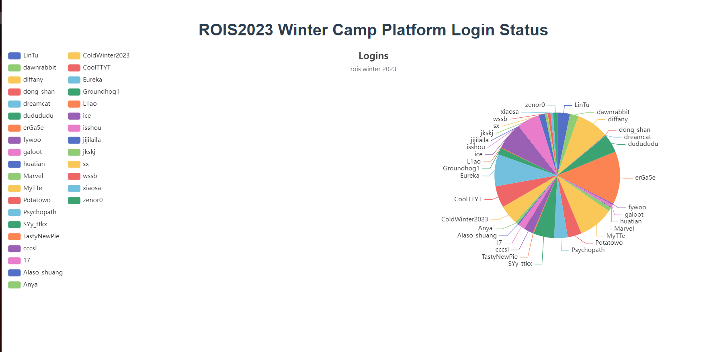

## 大数据

大数据由巨型[数据集](https://zh.wikipedia.org/wiki/%E6%95%B0%E6%8D%AE%E9%9B%86)组成，这些数据集大小常超出人类在可接受时间下的[收集](https://zh.wikipedia.org/w/index.php?title=%E6%95%B8%E6%93%9A%E6%94%B6%E9%9B%86&action=edit&redlink=1)、[庋用](https://zh.wikipedia.org/w/index.php?title=%E6%95%B8%E6%93%9A%E5%BA%8B%E7%94%A8&action=edit&redlink=1)、管理和处理能力[[16]](https://zh.wikipedia.org/wiki/%E5%A4%A7%E6%95%B8%E6%93%9A#cite_note-Editorial-16)。大数据的大小经常改变，截至2012年，单一数据集的大小从数[太字节](https://zh.wikipedia.org/wiki/%E5%A4%AA%E5%AD%97%E8%8A%82)（TB）至数十[兆亿字节](https://zh.wikipedia.org/wiki/%E6%8B%8D%E5%AD%97%E8%8A%82)（PB）不等。

## 分布式

分布式存储是一种数据存储技术，通过网络使用企业中的每台机器上的磁盘空间，并将这些分散的存储资源构成一个虚拟的存储设备，数据分散的存储在企业的各个角落。

分布式计算是一种计算方法，和集中式计算是相对的。

随着计算技术的发展，有些应用需要非常巨大的计算能力才能完成，如果采用集中式计算，需要耗费相当长的时间来完成。

分布式计算将该应用分解成许多小的部分，分配给多台计算机进行处理。这样可以节约整体计算时间，大大提高计算效率。

## why

随着数据量的增大，单从扩大计算机的资源方面已经很难满足日常需求并且费用昂贵。从而引起分布式的出现，分布式的出现可以将数据存储在多台计算机上，使用多台计算机来进行运算，解决了单个计算机资源不足的痛点

## 本文

本文通过是通过对网站日志数据的处理这一例子来学习大数据的大概流程

贴一个大致流程图（毕竟是给自己看的，凑合



flume -> hadoop -> hive -> hadoop -> mysql -> webserver -> browser

关于 定时任务这块 做个了解 并没有源源不断的数据

本文记录每个工具的基本使用

## 环境

CentOS 7 1核2G 测试环境仅使用一台机子
java 1.8.0_361
flume 1.9.0
azkaban
hadoop 3.1.0
sqoop 1.4.7
hive 3.1.2-bin
mysql 5.7.35

### jdk

```bash
vim /etc/profile
# 文件末尾增加
export JAVA_HOME=/opt/server/jdk1.8.0_361
export PATH=${JAVA_HOME}/bin:$PATH
source /etc/profile
```

### hadoop

Hadoop 组件之间需要基于 SSH 进行通讯，配置免密登录后不需要每次都输入密码

```bash
vim /etc/hosts
# 文件末尾增加
192.168.80.100 server


ssh-keygen -t rsa
cd ~/.ssh
cat id_rsa.pub >> authorized_keys
chmod 600 authorized_keys
```

配置hadoop

```bash
vim hadoop-env.sh
export JAVA_HOME=/opt/server/jdk1.8.0_361 # java目录
```

```bash
# 修改 core-site.xml指定hdfs 协议文件系统的通信地址及hadoop 存储临时文件的目录
<configuration>
    <property>
        <!--指定 namenode 的 hdfs 协议文件系统的通信地址-->
        <name>fs.defaultFS</name>
        <value>hdfs://server:8020</value>
    </property>
    <property>
        <!--指定 hadoop 数据文件存储目录-->
        <name>hadoop.tmp.dir</name>
        <value>/home/hadoop/data</value>
    </property>
</configuration>


# 修改hdfs-site.xml，指定 dfs 的副本系数
<configuration>
    <property>
        <!--由于我们这里搭建是单机版本，所以指定 dfs 的副本系数为 1-->
        <name>dfs.replication</name>
        <value>1</value>
    </property>
</configuration>

# 修改workers文件，配置所有从属节点
vim workers
# 配置所有从属节点的主机名或 IP 地址，由于是单机版本，所以指定本机即可：
server
```

初始化并且启动hdfs

```bash
关闭防火墙，不然web访问不到
# 关闭防火墙:
sudo systemctl stop firewalld
# 禁止开机启动
sudo systemctl disable firewalld

cd /opt/server/hadoop-3.1.0/bin
./hdfs namenode -format


cd /opt/server/hadoop-3.1.0/sbin/
# 编辑start-dfs.sh、stop-dfs.sh,在顶部加入以下内容，使得可以使用root启动集群
HDFS_DATANODE_USER=root
HDFS_DATANODE_SECURE_USER=hdfs
HDFS_NAMENODE_USER=root
HDFS_SECONDARYNAMENODE_USER=root

cd /opt/server/hadoop-3.1.0/sbin/
./start-dfs.sh # 启动 HDFS：

jps # 执行 jps 查看 NameNode 和 DataNode 服务是否已经启动：
```

web ui 界面端口为：9870

### hadoop（yarn）

```bash
# 修改mapred-site.xml文件
<configuration>
    <property>
        <name>mapreduce.framework.name</name>
        <value>yarn</value>
    </property>
    <property>
        <name>yarn.app.mapreduce.am.env</name>
        <value>HADOOP_MAPRED_HOME=${HADOOP_HOME}</value>
    </property>
    <property>
        <name>mapreduce.map.env</name>
        <value>HADOOP_MAPRED_HOME=${HADOOP_HOME}</value>
    </property>
    <property>
        <name>mapreduce.reduce.env</name>
        <value>HADOOP_MAPRED_HOME=${HADOOP_HOME}</value>
    </property>
</configuratio


# 修改yarn-site.xml文件，配置 NodeManager 上运行的附属服务
<configuration>
    <property>
        <!--配置 NodeManager 上运行的附属服务。需要配置成 mapreduce_shuffle 后才可以在Yarn 上运行 MapRedvimuce 程序。-->
        <name>yarn.nodemanager.aux-services</name>
        <value>mapreduce_shuffle</value>
    </property>
</configuration>


# start-yarn.sh stop-yarn.sh在两个文件顶部添加以下内容
YARN_RESOURCEMANAGER_USER=root
HADOOP_SECURE_DN_USER=yarn
YARN_NODEMANAGER_USER=root

# 启动 YARN
./start-yarn.sh

# 测试功能
hadoop jar /opt/server/hadoop-3.1.0/share/hadoop/mapreduce/hadoop-mapreduce-examples-3.1.0.jar pi 2 10
```

web ui 端口 8088

### mysql

```sql
# 登录mysql
mysql -u root -p
Enter password:     #输入在日志中生成的临时密码
# 更新root密码 设置为root
set global validate_password_policy=0;
set global validate_password_length=1;
set password=password('root');
# 授予远程连接权限
grant all privileges on *.* to 'root' @'%' identified by 'root';
# 刷新
flush privileges;
```

### hive

```bash
# 上传mysql-connector-java-5.1.38.jar 添加mysql_jdbc驱动
cd /opt/server/apache-hive-3.1.2-bin/lib

cd /opt/server/apache-hive-3.1.2-bin/conf
cp hive-env.sh.template hive-env.sh
vim hive-env.sh
# 加入以下内容
HADOOP_HOME=/opt/server/hadoop-3.1.0

# 新建 hive-site.xml 文件，配置存放元数据的 MySQL 的地址、驱动、用户名和密码等信息
vim hive-site.xml
<?xml version="1.0"?>
<?xml-stylesheet type="text/xsl" href="configuration.xsl"?>
<configuration>
    <!-- 存储元数据mysql相关配置 /etc/hosts -->
    <property>
        <name>javax.jdo.option.ConnectionURL</name>
        <value> jdbc:mysql://server:3306/hive?
createDatabaseIfNotExist=true&amp;useSSL=false&amp;useUnicode=true&amp;chara
cterEncoding=UTF-8</value>
    </property>
    <property>
        <name>javax.jdo.option.ConnectionDriverName</name>
        <value>com.mysql.jdbc.Driver</value>
    </property>
    <property>
        <name>javax.jdo.option.ConnectionUserName</name>
        <value>root</value>
    </property>
    <property>
        <name>javax.jdo.option.ConnectionPassword</name>
        <value>root</value>
    </property>
</configuration>

# 动初始化元数据库
cd /opt/server/apache-hive-3.1.2-bin/bin
./schematool -dbType mysql -initSchema
```

使用起来和sql类似

### flume

```bash
# 编写一个 taildir-hdfs.conf  监控 /var/log/nginx 目录下的日志文件

vim taildir-hdfs.conf
a3.sources = r3
a3.sinks = k3
a3.channels = c3
# Describe/configure the source
a3.sources.r3.type = TAILDIR
a3.sources.r3.filegroups = f1
# 此处支持正则
a3.sources.r3.filegroups.f1 = /var/log/nginx/access.log
# 用于记录文件读取的位置信息
a3.sources.r3.positionFile = /opt/server/apache-flume-1.9.0-bin/tail_dir.json
# Describe the sink
a3.sinks.k3.type = hdfs
a3.sinks.k3.hdfs.path = hdfs://server:8020/user/tailDir
a3.sinks.k3.hdfs.fileType = DataStream
# 设置每个文件的滚动大小大概是 128M，默认值：1024，当临时文件达到该大小（单位：bytes）时，滚动成目标文件。如果设置成0，则表示不根据临时文件大小来滚动文件。
a3.sinks.k3.hdfs.rollSize = 134217700
# 默认值：10，当events数据达到该数量时候，将临时文件滚动成目标文件，如果设置成0，则表示不根据events数据来滚动文件。
a3.sinks.k3.hdfs.rollCount = 0
# 不随时间滚动，默认为30秒
a3.sinks.k3.hdfs.rollInterval = 10
# flume检测到hdfs在复制块时会自动滚动文件，导致roll参数不生效，要将该参数设置为1；否则HFDS文件所在块的复制会引起文件滚动
a3.sinks.k3.hdfs.minBlockReplicas = 1
# Use a channel which buffers events in memory
a3.channels.c3.type = memory
a3.channels.c3.capacity = 1000
a3.channels.c3.transactionCapacity = 100
# Bind the source and sink to the channel
a3.sources.r3.channels = c3
a3.sinks.k3.channel = c3
```

启动 flume

```bash
bin/flume-ng agent -c ./conf -f ./conf/taildir-hdfs.conf -n a3 -Dflume.root.logger=INFO,console
```

### sqoop

```bash
# 编辑配置文件
cd /opt/server/sqoop-1.4.7.bin__hadoop-2.6.0/conf
cp sqoop-env-template.sh sqoop-env.sh
vim sqoop-env.sh
# 加入以下内容
export HADOOP_COMMON_HOME=/opt/server/hadoop-3.1.0
export HADOOP_MAPRED_HOME=/opt/server/hadoop-3.1.0
export HIVE_HOME=/opt/server/apache-hive-3.1.2-bin

# 加入mysql的jdbc驱动包mysql-connector-java-5.1.38.jar
cd /opt/server/sqoop-1.4.7.bin__hadoop-2.6.0/lib


# 导入/导出数据
create table test1(
	id int unsigned auto_increment,
	name varchar(20),
	primary key(id)
);
insert into test1(name) values("fuck");

./sqoop import \
--connect jdbc:mysql://192.168.80.100:3306/sqoop \
--username root  --password root \
--table test1 \
--target-dir /appendresult \
--incremental append \
--check-column id \
--last-value  1


create database exportfortest;
create table test1(
	id int unsigned auto_increment,
	name varchar(20),
	primary key(id)
);
./sqoop export \
--connect jdbc:mysql://192.168.80.100:3306/ctfd \
--username root \
--password root \
--table test1 \
--export-dir /appendresult/part-m-00000

# 创建任务
./sqoop job --create job_test2 \
-- import \
--connect jdbc:mysql://192.168.80.100:3306/sqoop \
--username root \
--password-file /mysql/pwd/mysqlpwd.pwd \
--table test \
--target-dir /crontabtest \
--check-column last_mod \
--incremental lastmodified \
--last-value "2023-03-02 09:20:08" \
--m 1 \
--append
```

## 数据处理流程

寒假有办了个线上冬令营，把网站的日志拿过来做分析

数据来源：ctfd 的 logins.log 日志文件

导入数据

```bash
[root@bigdatalearning data]# hdfs dfs -ls /ctfd
[root@bigdatalearning data]# hdfs dfs -put logins.log /ctfd/logins.log
[root@bigdatalearning data]# hdfs dfs -ls /ctfd
Found 1 items
-rw-r--r--   1 root supergroup      83483 2023-03-03 18:24 /ctfd/logins.log
```

hive数据处理

```
use ctfd;

create table logins (content string);

load data inpath '/ctfd/logins.log' into table logins;

CREATE TABLE logins_res (visit_id string,visit_count int) ROW FORMAT DELIMITED FIELDS TERMINATED BY '\t';

INSERT INTO TABLE logins_res
SELECT visit_id, COUNT(*) AS visit_count
FROM (
  SELECT regexp_extract(content, '\\[(.*?)\\]', 1) AS visit_time,
         regexp_extract(content, '\\d+\\.\\d+\\.\\d+\\.\\d+', 0) AS ip_address,
         regexp_extract(content, ' - (\\w+) ', 1) AS visit_id
  FROM logins
) log_parsed
GROUP BY visit_id;
```

sqoop 转存

```bash
# mysql里面创建个表
create table test1(
	name varchar(50),
  	value int
);

# 将HDFS/user/hive/warehouse/ctfd.db/logins_res文件中的数据导出到mysql的test1表中
./sqoop export \
--connect jdbc:mysql://192.168.80.100:3306/ctfd \
--username root \
--password root \
--table test1 \
--export-dir /user/hive/warehouse/ctfd.db/logins_res
```

web

用python写个后端返回数据

```python
#!/usr/bin/python3
from flask import Flask,jsonify
import pymysql as pmq
from pymysql import cursors
#connect(ip.user,password,dbname)
app = Flask(__name__)
@app.route("/api")
def index():
    con = pmq.connect(host="localhost", user="root", password="root", database="ctfd", cursorclass=cursors.DictCursor)
    #操作游标
    cur = con.cursor()
    cur.execute('select * from test1')
    results = cur.fetchall()
    return jsonify(results)

if __name__ == "__main__":
    app.run(host="0.0.0.0",port = "15000",debug=True)
```

browser

前端用vue + echarts 展示

```
<template>
  <h1>{{ msg }}</h1>
  <div class="hello" id="main">
  </div>
</template>

<script>
import * as echarts from 'echarts';
import 'echarts/map/js/china.js'
import axios from 'axios';

export default {
  data: function () {
    return {
      option: {
        title: {
          text: 'Logins',
          subtext: 'rois winter 2023',
          left: 'center'
        },
        tooltip: {
          trigger: 'item'
        },
        legend: {
          orient: 'vertical',
          left: 'left'
        },
        series: [
          {
            name: 'Access From',
            type: 'pie',
            center: ['75%', '50%'],    
            radius: '50%',
            data: [],
            emphasis: {
              itemStyle: {
                shadowBlur: 10,
                shadowOffsetX: 0,
                shadowColor: 'rgba(0, 0, 0, 0.5)'
              }
            }
          }
        ]
      }
    }
  },
  name: 'HelloWorld',
  props: {
    msg: String
  },
  mounted() {
    var myChart = echarts.init(document.getElementById('main'));
    axios.get("/api").then((response) => {
      this.option.series[0].data = response.data;
      // 绘制图表
      this.option = { ...this.option };
      myChart.setOption(this.option);
    });
    // var mydata = [
    //   { value: 1048, name: 'Search Engine' },
    //   { value: 735, name: 'Direct' },
    //   { value: 580, name: 'Email' },
    //   { value: 484, name: 'Union Ads' },
    //   { value: 300, name: 'Video Ads' }
    // // ];
    // this.option.series[0].data = mydata;
    // // 绘制图表
    // this.option = { ...this.option };
    // myChart.setOption(this.option);
  }
}
</script>

<!-- Add "scoped" attribute to limit CSS to this component only -->
<style scoped>
.hello {
  width: 100%;
  height: 500px;
}
</style>
```

## 最终效果



## 问题与思考

todo
