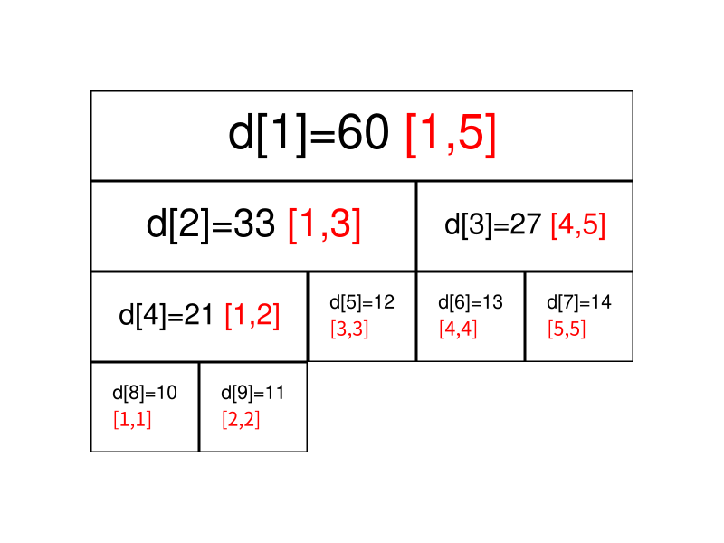
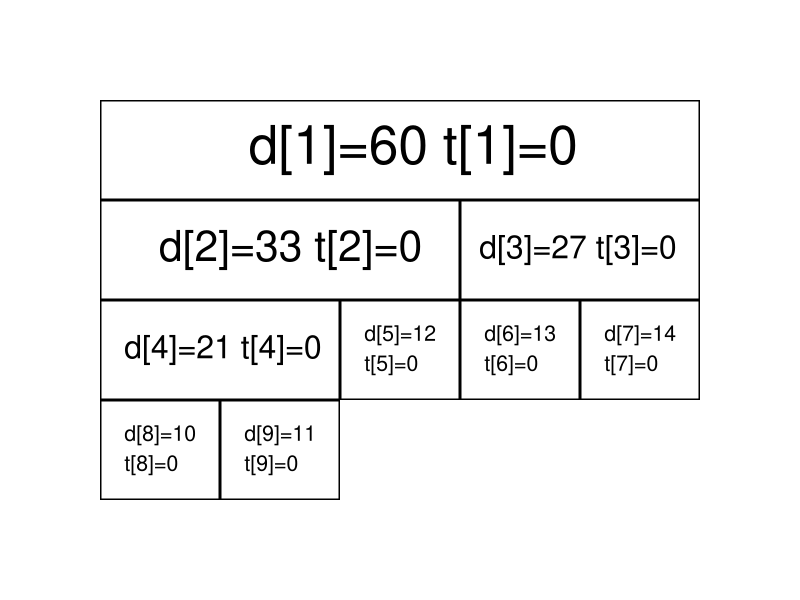
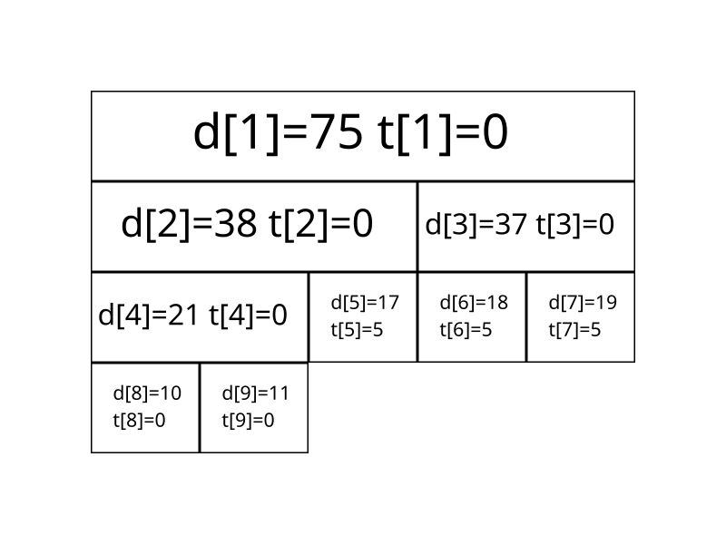

# 数据结构与算法

## 线段树

- 线段树是算法竞赛中常用的用来维护 **区间信息** 的数据结构。
- 线段树可以在o(log n)的时间复杂度内实现单点修改、区间修改、区间查询（区间求和，求区间最大值，求区间最小值）等操作。
- 线段树维护的信息在很多时候可以认为是满足（幺）半群的性质的信息。
- 参考 [线段树 - OI Wiki (oi-wiki.org)](https://oi-wiki.org/ds/seg/)

### 测试代码

```c++
#include<bits/stdc++.h>
using namespace std;
int a[5] = {10, 11, 12, 13, 14};
int d[100],b[100];
void build(int s, int t, int p) {
  // 对 [s,t] 区间建立线段树,当前根的编号为 p
  if (s == t) {
    d[p] = a[s];
    return;
  }
  int m = s + ((t - s) >> 1);
  // 移位运算符的优先级小于加减法，所以加上括号
  // 如果写成 (s + t) >> 1 可能会超出 int 范围
  build(s, m, p * 2), build(m + 1, t, p * 2 + 1);
  // 递归对左右区间建树
  d[p] = d[p * 2] + d[(p * 2) + 1];
}
int getsum(int l, int r, int s, int t, int p) {
  // [l, r] 为查询区间, [s, t] 为当前节点包含的区间, p 为当前节点的编号
  if (l <= s && t <= r)
    return d[p];  // 当前区间为询问区间的子集时直接返回当前区间的和
  int m = s + ((t - s) >> 1), sum = 0;
  if (l <= m) sum += getsum(l, r, s, m, p * 2);
  // 如果左儿子代表的区间 [l, m] 与询问区间有交集, 则递归查询左儿子
  if (r > m) sum += getsum(l, r, m + 1, t, p * 2 + 1);
  // 如果右儿子代表的区间 [m + 1, r] 与询问区间有交集, 则递归查询右儿子
  return sum;
}
void update(int l, int r, int c, int s, int t, int p) {
  // [l, r] 为修改区间, c 为被修改的元素的变化量, [s, t] 为当前节点包含的区间, p
  // 为当前节点的编号
  if (l <= s && t <= r) {
    d[p] += (t - s + 1) * c, b[p] += c;
    return;
  }  // 当前区间为修改区间的子集时直接修改当前节点的值,然后打标记,结束修改
  int m = s + ((t - s) >> 1);
  if (b[p] && s != t) {
    // 如果当前节点的懒标记非空,则更新当前节点两个子节点的值和懒标记值
    d[p * 2] += b[p] * (m - s + 1), d[p * 2 + 1] += b[p] * (t - m);
    b[p * 2] += b[p], b[p * 2 + 1] += b[p];  // 将标记下传给子节点
    b[p] = 0;                                // 清空当前节点的标记
  }
  if (l <= m) update(l, r, c, s, m, p * 2);
  if (r > m) update(l, r, c, m + 1, t, p * 2 + 1);
  d[p] = d[p * 2] + d[p * 2 + 1];
}
int main() {
    build(0,4,1);//建树
    for (int i = 0; i < 10; i++) {
        cout<<d[i]<<" ";
    }
    cout<<endl;
    int sum = getsum(2, 4, 0, 4, 1);//求和
    cout<<sum<<endl;
    update(4, 4, 4, 0, 4, 1);//修改[4,4]位置上的值
    sum = getsum(2, 4, 0, 4, 1);//求和
    cout<<sum<<endl;
}
```

#### 2.4 guard (oj题目)

- Description

部队中共有 N*N* 个士兵，每个士兵有各自的能力指数 X_i*X**i* ，在一次演练中，指挥部确定了 M*M* 个需要防守的地点，按重要程度从低到高排序，依次以数字 11 到 M*M* 标注每个地点的重要程度，指挥部将选择 M*M* 个士兵依次进入指定地点进行防守任务，能力指数为 X*X* 的士兵防守重要程度为 Y*Y* 的地点将得到 X\cdot Y*X*⋅*Y* 的参考指数。现在士兵们排成一排，请你选择出连续的 M*M* 个士兵依次参加防守，使得总的参考指数值最大。

- Input

输入第一行有两个整数 N,M(1\le N\le1000000,1\le M\le 1000, M\le N)*N*,*M*(1≤*N*≤1000000,1≤*M*≤1000,*M*≤*N*)

第二行 N*N* 个整数表示每个士兵对应的能力指数 X_i*X**i*（1\le X_i\le10001≤*X**i*≤1000）

- Output

输出一个整数，为最大的参考指数总和。

- Sample Input 1

```
5 3
2 1 3 1 4
```

- Sample Output 1

```
17
```

```c++
#include<bits/stdc++.h>
using namespace std;
typedef long long ll;
int main(){
    ll n,m,tmp = 0,final = 0;
    scanf("%lld %lld", &n, &m);
    ll a[n + 1],b[n + 1],c[n + 1];
    a[0] = 0; b[0] = 0; c[0] = 0;
    for (int i = 1; i < n + 1; i++) {
        scanf("%lld",&a[i]);
        b[i] = b[i - 1] + a[i];
        c[i] = c[i - 1] + b[i];
        if (i >= m) {
            if ( i==m ){
                tmp = m * b[i] - c[i - 1];
            } else {
                tmp = m * b[i] - c[i - 1] + c[i - 1 - m];
            }
            final = final > tmp ? final : tmp;
        }
    }
    printf("%lld",final);
    return 0;
}
```

### 线段树的基本结构与建树

线段树将每个长度不为1的区间划分成左右两个区间递归求解，把整个线段划分为一个树形结构，通过合并左右两区间信息来求得该区间的信息。这种数据结构可以方便的进行大部分的区间操作。

有个大小为5的数组a = {10, 11, 12, 13, 14}，要将其转化为线段树

红色表示区间 d[i] 表示集合和



di的左儿子节点就是d2xi ， di的右儿子节点就是d2xi+1 。如果 di表示的是区间[s,t] ,那么di的左儿子节点表示的是区间[s,(s+t)/2] di的右儿子表示的是区间[(s+t)/2+1,t]

- 递归建树
  ```c++
  // C++ Version
  void build(int s, int t, int p) {
    // 对 [s,t] 区间建立线段树,当前根的编号为 p
    if (s == t) {
      d[p] = a[s];
      return;
    }
    int m = s + ((t - s) >> 1);
    // 移位运算符的优先级小于加减法，所以加上括号
    // 如果写成 (s + t) >> 1 可能会超出 int 范围
    build(s, m, p * 2), build(m + 1, t, p * 2 + 1);
    // 递归对左右区间建树
    d[p] = d[p * 2] + d[(p * 2) + 1];
  }
  ```
  关于线段树的空间：如果采用堆式存储（2p 是p 的左儿子，2p+1 是 p的右儿子），若有 n个叶子结点，则 d 数组的范围最大为2的logn + 1 次方 。
  懒得计算的话可以直接把数组长度设为 4n

### 线段树的区间查询

一般地，如果要查询的区间是 [l,r]，则可以将其拆成最多为 O(log n)个 **极大** 的区间，合并这些区间即可求出 [l,r]的答案。


```c++
// C++ Version
int getsum(int l, int r, int s, int t, int p) {
  // [l, r] 为查询区间, [s, t] 为当前节点包含的区间, p 为当前节点的编号
  if (l <= s && t <= r)
    return d[p];  // 当前区间为询问区间的子集时直接返回当前区间的和
  int m = s + ((t - s) >> 1), sum = 0;
  if (l <= m) sum += getsum(l, r, s, m, p * 2);
  // 如果左儿子代表的区间 [l, m] 与询问区间有交集, 则递归查询左儿子
  if (r > m) sum += getsum(l, r, m + 1, t, p * 2 + 1);
  // 如果右儿子代表的区间 [m + 1, r] 与询问区间有交集, 则递归查询右儿子
  return sum;
}
```

### 线段树的区间修改与懒惰标记

如果要求修改区间 ，[l,r]把所有包含在区间 [l,r]中的节点都遍历一次、修改一次，时间复杂度无法承受。这里要引入一个叫做 **「懒惰标记」** 的东西。

懒惰标记，简单来说，就是通过延迟对节点信息的更改，从而减少可能不必要的操作次数。每次执行修改时，我们通过打标记的方法表明该节点对应的区间在某一次操作中被更改，但不更新该节点的子节点的信息。实质性的修改则在下一次访问带有标记的节点时才进行。

以最开始的图为例，我们将执行若干次给区间内的数加上一个值的操作。我们现在给每个节点增加一个ti ，表示该节点带的标记值。



现在我们准备给 [3,5]上的每个数都加上 5。我们直接在这两个节点上进行修改，并给它们打上标记：


我们通过递归找到 [4,5]区间，发现该区间并非我们的目标区间，且该区间上还存在标记。这时候就到标记下放的时间了。我们将该区间的两个子区间的信息更新，并清除该区间上的标记。



区间修改（区间加上某个值）：

```c++
// C++ Version
void update(int l, int r, int c, int s, int t, int p) {
  // [l, r] 为修改区间, c 为被修改的元素的变化量, [s, t] 为当前节点包含的区间, p
  // 为当前节点的编号
  if (l <= s && t <= r) {
    d[p] += (t - s + 1) * c, b[p] += c;
    return;
  }  // 当前区间为修改区间的子集时直接修改当前节点的值,然后打标记,结束修改
  int m = s + ((t - s) >> 1);
  if (b[p] && s != t) {
    // 如果当前节点的懒标记非空,则更新当前节点两个子节点的值和懒标记值
    d[p * 2] += b[p] * (m - s + 1), d[p * 2 + 1] += b[p] * (t - m);
    b[p * 2] += b[p], b[p * 2 + 1] += b[p];  // 将标记下传给子节点
    b[p] = 0;                                // 清空当前节点的标记
  }
  if (l <= m) update(l, r, c, s, m, p * 2);
  if (r > m) update(l, r, c, m + 1, t, p * 2 + 1);
  d[p] = d[p * 2] + d[p * 2 + 1];
}
```

## 欧拉筛

### 埃式筛法

先来介绍埃式筛法，埃式筛法的基本思想就是，当我们遍历到一个素数时，把所有该素数的倍数（自然是合数）都筛选出来，我们来看看代码：

```c++
int prime[MAXN];
bool vis[MAXN];
int cnt=0;
void Era_prime(int n)
{
	for(int i=2;i<=n;++i)
	{
		if(!vis[i])
			prime[cnt++]=i;
		for(int j=i;j<=n;j+=i)
		{
			vis[j]=true;
		}
	}
}
```

当我们有没被选过的素数时，加入素数数组prime并且将它的所有n以内的倍数给筛选出来（vis[j]=true），埃式筛法很容易理解，并且在效率上也比较优秀，时间复杂度为O(nlglgn)，

但是在处理1e8以上的数据时，还是稍稍力不从心，所以接下来我们着重介绍下线性时间筛法——欧拉筛法，我们还是先来看下代码：

```c++
int prime[MAXN];
bool vis[MAXN];
int cnt=0;
void Euler_prime(int n)
{
	for(int i=2;i<=n;++i)
	{
		if(!vis[i])
		{prime[cnt++]=i;}//vis[i]置为true或不置true都可以
		for(int j=0;j<cnt;++j)
		{
			if(i*prime[j]>n)//判断是否越界
				break;
			vis[i*prime[j]]=true;//筛数
			if(i%prime[j]==0)//时间复杂度为O(n)的关键！
				break;
		}
	}
}
```

### oj代码

#### 素数区间

- Description

dark di 在做数学题目的时候发现了一个现象，2 个相邻的素数之间存在一个区间，他把这个区间称为非素数区间，那么 dark di 想知道，给定一个正整数 x*x* ，x*x* 所在的非素数区间长度是多少呢？ 例如 23 和 29 是 2 个相邻的素数，他们之间的非素数区间是 [24,28][24,28] ，长度是 5，假设 x=27*x*=27 ，那么 x*x* 所在的非素数区间长度就是 5。如果 x*x* 是一个素数，则答案是 0。

注意：素数指的是除了1和它本身以外不再有其他因数的自然数。

- Input

第一行输入一个正整数 T*T* ，表示接下去有 T*T* 次询问。

接下去T行，每行一个正整数 x*x* 。(x\le10^5)(*x*≤105)

对于30%的数据，T\le5,x\le100*T*≤5,*x*≤100

对于80%的数据，T\le10,x\le5000*T*≤10,*x*≤5000

对于100%的数据，T\le10^5,x\le10^5*T*≤105,*x*≤105

- Output

输出 T*T* 行，每行一个整数表示非素数区间的长度。

Sample Input 1

```
1
27
```

Sample Output 1

```
5
```

- ac代码

```c++
#include<bits/stdc++.h>
using namespace std;
#define MAXN 200001
int prime[MAXN];
int vis[MAXN];
int cnt=0;
void Euler_prime(int n)
{
	for(int i=2;i<=n;++i)
	{
		if(!vis[i]) {
            prime[cnt++]=i;
        }//vis[i]置为true或不置true都可以
		for(int j=0;j<cnt;++j) {
			if(i*prime[j]>n)//判断是否越界
				break;
			vis[i*prime[j]]=1;//筛数
			if(i%prime[j]==0)//时间复杂度为O(n)的关键！
				break;
		}
	}
}
int main() {
    Euler_prime(200000);
    int times,tmp;
    scanf("%d",&times);
    for (int i = 0; i < times; i++)
    {
        scanf("%d",&tmp);
        if (tmp == 0 || tmp==1 || !vis[tmp]) {
            printf("0\n");
            continue;
        }
		int L=1,R=cnt,mid,ans; 
		while(L<=R)
		{
			mid=L+((R - L)>>1);
			if (prime[mid]<tmp)
			{
				ans=mid;
				L=mid+1;
			}
			else R=mid-1;
		}
		printf("%d\n",prime[ans+1]-prime[ans]-1); 
    }
    return 0;
}
```

## 单调栈

### 概念

u从名字上就听的出来，单调栈中存放的数据应该是有序的，所以单调栈也分为**单调递增栈**和**单调递减栈**

•单调递增栈：单调递增栈就是从栈底到栈顶数据是从大到小

•单调递减栈：单调递减栈就是从栈底到栈顶数据是从小到大

•**单调递增栈可以找到左起第一个比当前数字小的元素**

•**单调递减栈可以找到左起第一个比当前数字大的元素**

- 结构如下

```c++
stack<int> st;
for (遍历这个数组)
{
	if (栈空 || 栈顶元素大于等于当前比较元素)
	{
		入栈;
	}
	else
	{
		while (栈不为空 && 栈顶元素小于当前元素)
		{
			栈顶元素出栈;
			更新结果;
		}
		当前数据入栈;
	}
}
```

### oj代码

- 亲兄弟问题
- Description

给定 n*n* 个整数 A_0,A_1,\cdots,A_{n-1}*A*0,*A*1,⋯,*A**n*−1 组成的序列。序列中元素 A_i*A**i* 的亲兄弟 A_k*A**k* 定义为 A_i*A**i* 的右边最靠近它且不小于它的元素，即 k=min{j|A_j \ge A_i} (i<j<n)*k*=*m**i**n*{*j*∣*A**j*≥*A**i*}(*i*<*j*<*n*) 。

亲兄弟问题要求给定序列中每个元素的亲兄弟元素的位置。元素 A_i*A**i* 的亲兄弟元素为 A_k*A**k* 时，称 k*k* 为元素 A_i*A**i* 的亲兄弟元素的位置。当元素 A_i*A**i* 没有亲兄弟元素时，约定其亲兄弟元素的位置为 -1−1 。

例如，当 n=10*n*=10 ，整数序列为 6,1,4,3,6,2,4,7,3,56,1,4,3,6,2,4,7,3,5 时，相应的亲兄弟元素位置序列为 4,2,4,4,7,6,7,-1,9,-14,2,4,4,7,6,7,−1,9,−1 。

现在对于给定的 n*n* 个整数 A_0,A_1,\cdots,A_{n-1}*A*0,*A*1,⋯,*A**n*−1 组成的序列，求出相应的亲兄弟元素位置序列。

- Input

输入数据有两行。

第一行是一个数 n (1\le n\le600000)*n*(1≤*n*≤600000) ，表示给定 n 个整数。

第二行是 A_0,A_1,\cdots,A_{n-1} (A_i\le 10^6)*A*0,*A*1,⋯,*A**n*−1(*A**i*≤106) 。

- Output

输出计算出的与给定序列相应的亲兄弟元素位置序列。

- Sample Input 1

```
10
6 1 4 3 6 2 4 7 3 5
```

- Sample Output 1

```
4 2 4 4 7 6 7 -1 9 -1
```

```c++
#include<bits/stdc++.h>
using namespace std;
int main() {
    int n;
    scanf("%d",&n);
    stack<int> st;
    int nums[n],result[n];
    for (int i = 0; i < n; i++)
    {
        scanf("%d",&nums[i]);
        result[i] = -1;
    }
    
    for (int i = 0; i < n; i++)
    {
       while (!st.empty() && nums[st.top()] <= nums[i])
       {
            int temp = st.top();
            st.pop();
            result[temp]=i;
       }
       st.push(i);
    }
    for (int i = 0; i < n; i++)
    {
        cout<<result[i]<<" ";
    }
    
}
```
