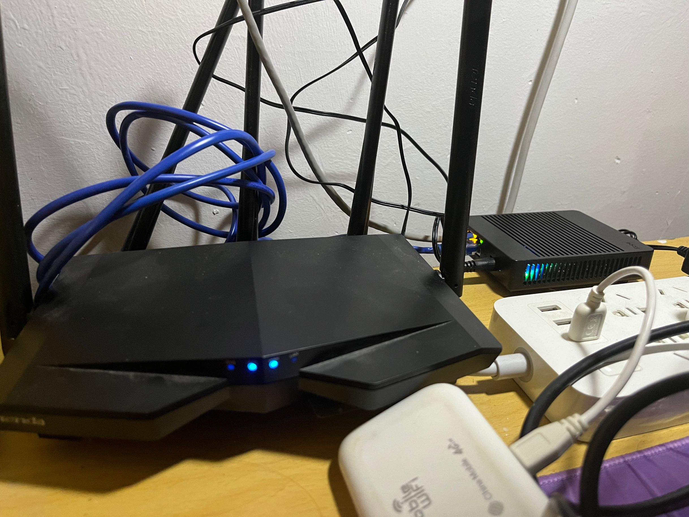
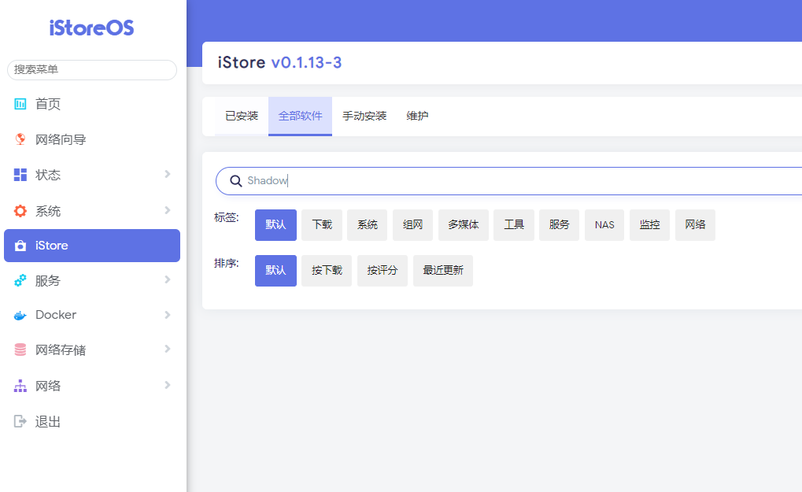
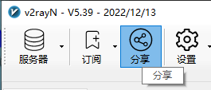

# 软路由折腾记录

前言：最近在YouTube上刷到挺多科学上网的东西，之前也直接整过代理，就想着买个软路由来捣鼓捣鼓，当然还有很多玩法待开发。



## 选购

结合YouTube上的推荐视频和自身的需求，我买了电犀牛的R66S，入门还是比较友好的，三百出头

全部的配件：路由器本身，充电器，tf卡32g，读卡器

## 刷固件

买回来已经自带了固件，但是ssr等等代理软件不自带

电犀牛官网：[https://r68s.cn/](https://r68s.cn/)

我刷了个istoreos固件，官网：[https://www.istoreos.com/](https://www.istoreos.com/)

刷机流程也比较简单，参考教程：[https://doc.linkease.com/zh/guide/istoreos/install_r66s.html](https://doc.linkease.com/zh/guide/istoreos/install_r66s.html)

1. 把原本的tf卡取下，插到读卡器接入电脑，插入电脑会让格式化u盘，我瞎点了，进去我的电脑发现出现两个盘，而且是几百兆这种，到计算机管理的磁盘管理下删去分区，再新建一整个分区。。
2. 创建启动盘，我使用的是Rufus，官网地址是：[https://rufus.ie/zh/，选择tf卡，选择固件，点开始即可](https://rufus.ie/zh/%EF%BC%8C%E9%80%89%E6%8B%A9tf%E5%8D%A1%EF%BC%8C%E9%80%89%E6%8B%A9%E5%9B%BA%E4%BB%B6%EF%BC%8C%E7%82%B9%E5%BC%80%E5%A7%8B%E5%8D%B3%E5%8F%AF)
3. 启动盘创建好后，将tf插回R66S即可，开机进入web界面默认：[http://192.168.100.1/](http://192.168.100.1/) 账号/密码：root/password，ssh密码一样

到此固件就成功刷入了，感觉用tf卡对小白挺友好的，也可以通过web端刷入

## 拓展功能

istoreos也没有自带ssr这种插件，iStore中也没有



到这个项目中下载插件手动安装：[https://github.com/AUK9527/Are-u-ok](https://github.com/AUK9527/Are-u-ok)

R66S的是 aarch64_cortex-a53平台，并不是x86

然后就可以把ssrplus装上了

在实验室中更新机场订阅一直不成功，解决方案：手动添加一个节点，挂上节点后更新



其他拓展：istorex（一个网页主题），AdGuard Home（广告拦截器）

## 校园网认证

宿舍的网络需要进行认证

经过测试发现，在没有验证时访问一个页面比如：[http://www.baidu.com/](http://www.baidu.com/)

返回，其中host_fzu为校园网ip，下面亦然

```html
<script>top.self.location.href='http://host_fzu/eportal/index.jsp?get传入一些值包含设备mac值等等'</script>
```

而校园网认证的login只需要账号密码和设备的信息，可以在上面未认证的html中获取

只需要两个http即可实现校园网认证

```python
import requests
from bs4 import BeautifulSoup
from urllib.parse import quote
from tqdm import tqdm
from colorama import init, Fore
from datetime import datetime

current_time = datetime.now()
formatted_time = current_time.strftime("%Y-%m-%d %H:%M:%S")
print(f"current time: {formatted_time}\nlog:", end=" :")

host_fzu = ""
userId = ""
password = ""
# proxies = {
#     "http": "http://127.0.0.1:8080/"
# }
init()  # init colorama


def get_authenticated_url():
    test_con_url = "http://36.152.44.96/"
    r = requests.get(url=test_con_url, timeout=3)
    connected = host_fzu not in r.text
    if connected:
        print(f"{Fore.GREEN}connected.....{Fore.RESET}", end='\r', flush=True)
        return True, ""
    
    soup = BeautifulSoup(r.text, 'html.parser')
    script_tag = soup.find('script')
    authentication_url = script_tag.text.split("'")[1]
    if host_fzu not in authentication_url:
        print(f"{Fore.GREEN}connected.....{Fore.RESET}", end='\r', flush=True)
    else:
        print(f"{Fore.RED}not connected.....{Fore.RESET}", end='\r', flush=True)
    return connected, authentication_url


def post_authenticated_packet(userId, password, queryString):
    authenticated_data = {
        "userId": quote(userId),
        "password": quote(password),
        "service": "",
        "queryString": quote(queryString),
        "operatorPwd": "",
        "operatorUserId": "",
        "validcode": "",
        "passwordEncrypt": "false",
    }
    authenticated_url_login = f"http://{host_fzu}/eportal/InterFace.do?method=login"
    r = requests.post(url=authenticated_url_login, data=authenticated_data)
    json_data = r.json()
    if json_data["result"] == "success":
        print(f"{Fore.GREEN}Authentication succeeded.....{Fore.RESET}", end='\r', flush=True)
    else:
        print(f"{Fore.RED}Authentication failed.....{Fore.RESET}", end='\r', flush=True)


if __name__ == "__main__":
    try:
        connected, queryString = get_authenticated_url()
        if not connected:
            print(queryString)
            post_authenticated_packet(userId, password, queryString)
    except Exception as e:
        print(f"{Fore.RED}An error occurred: {e}{Fore.RESET}", end='\r', flush=True)
    print()
```

填入信息，执行脚本即可进行校园网认证

在软路由上写入计划任务

在此之前需要安装python3，pip和所需要的包

```bash
opkg update
opkg install python3
opkg install python3-pip
pip3 install requests
pip3 install beautifulsoup4
pip3 install tqdm
pip3 install colorama
```

写入计划任务，可以在web端设置，道理一样

```
* * * * * /usr/bin/python3 /root/school/school.py >> /var/log/school.log
0 18 * * * echo '' > /var/log/school.log
```

这个计划任务的意思就是，每一分钟执行一次，然后将结果输出到日志中，每天18点清空日志

这个脚本的意思就是，检测是否能够正常访问36.152.44.96（百度），不能的话就提交表单认证

## 校园网绕过设备检测尝试

参考：

[https://xavier.wang/45-suck-shit-lan/](https://xavier.wang/45-suck-shit-lan/)

[https://www.jja8.cn/article/%E6%A0%A1%E5%9B%AD%E7%BD%91%E5%A4%9A%E8%AE%BE%E5%A4%87%E4%BD%BF%E7%94%A8%E5%90%8C%E4%B8%80%E4%B8%AA%E8%B4%A6%E5%8F%B7%E9%98%B2%E6%A3%80%E6%B5%8B/](https://www.jja8.cn/article/%E6%A0%A1%E5%9B%AD%E7%BD%91%E5%A4%9A%E8%AE%BE%E5%A4%87%E4%BD%BF%E7%94%A8%E5%90%8C%E4%B8%80%E4%B8%AA%E8%B4%A6%E5%8F%B7%E9%98%B2%E6%A3%80%E6%B5%8B/)

成功修改ttl，和软路由隔着一个路由器，所以本地ping出去的ttl要减去两条

```bash
iptables -t mangle -A PREROUTING -i eth0 -j TTL --ttl-set 64
iptables -t mangle -A PREROUTING -i br-lan -j TTL --ttl-set 64
```

修改ntp，不知道怎么验证。。。

修改ua：Privoxy，修改成功80端口的http流量的ua成功修改，但是添加443端口ua修改失败，应该没证书的原因？SSL…

时不时黑名单十分钟，说明上面不怎么管用呃呃呃

## bug

连上第一天，qq的群头像加载不出来，没怎么在意

第二天起床，看看微信公众号推文，公众号推文的图片也加载不出来，起床排查

以为是昨晚捣鼓绕过校园网导致的，把配置一步一步改回去，没有效果，重置路由器，可以成功加载图片，但是在我装几个插件后又不能使用，再重置，不能加载图片，查看图片的地址，手动ping，ping不通，到R66S上面ping，ping不通，但是可以通百度等等。。。云主机ping，可以ping通，于是确实是DNS的问题，更换dns服务器为阿里公共DNS：223.5.5.5和223.6.6.6，解决问题

脚本bug，修改dns后，在未认证下，找不到百度的host，于是乎我把脚本中的域名换为ip
