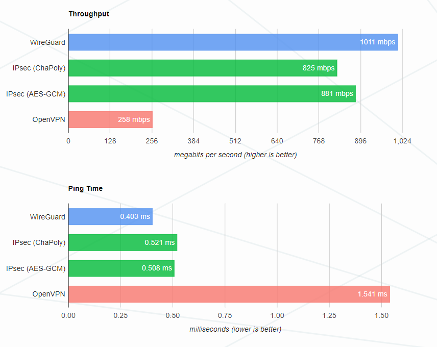
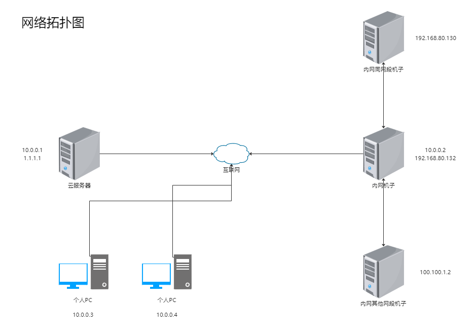

# WireGuard 使用记录

之前打强网杯线下赛，只穿了个socks代理以至于二进制的同学不能接入网络。于是便使用 iptables + wg-easy 来实现一个内网穿透

OK，开始正题。现在需要支持在外面远程访问内网，可以实现类似内网访问的操作以支持二进制解题的网络需求

## WireGuard

WireGuard是一种快速、现代的虚拟私人网络（VPN）协议。相对于其他VPN协议，WireGuard更加轻量级且易于配置和管理。它可以在多种操作系统上运行，包括Linux、Windows、macOS、iOS和Android。

WireGuard协议采用了最新的加密技术，比如Curve25519椭圆曲线加密和ChaCha20加密算法。它的数据包头部非常小，只有80字节，这使得它在传输数据时的开销非常小，因此它在延迟和吞吐量上的表现非常出色。与其他VPN协议相比，WireGuard的连接速度更快、更可靠、更稳定，并且在重连时也能够自动恢复连接。

总的来说，WireGuard是一种安全、高效、简单易用的VPN协议，因此它在当前的VPN市场上越来越受到青睐。

以下是WireGuard的性能对比



wg-easy 可以让我们在任何 Linux 主机上更加方便地安装和管理 WireGuard，项目地址：[https://github.com/WeeJeWel/wg-easy](https://github.com/WeeJeWel/wg-easy)

优点：快速部署，配置文件的快速下发，方便管理，docker部署对云服务器不会产生影响

## 网络拓扑图

话不多说，开始安装吧。网络拓扑大致如下。



其中：

- `1.1.1.1` 为服务器的公网 IP
- `192.168.80.0/24` 为内网的 IP 段
- `10.0.0.0/24` 为 WireGuard 的 VPN 内网网段
- `100.100.1.0/24` 为内网其他网段的 IP 段

最终实现的效果是，互联网上的其他主机通过连接 `1.1.1.1` 上的 VPN 服务，接入内网机子网段。

即：个人PC可以访问到100.100.1.2，192.168.80.130等等

## 安装 WireGuard

需要在 个人PC 和 内网机子（此处IP为 10.0.0.2） 上安装，其他不需要安装WireGuard

[https://www.wireguard.com/install/](https://www.wireguard.com/install/)

WireGuard 不区分服务端与客户端，安装也比较简单，不出意外的话可以一行命令直接安装。

## 部署 wg-easy

原本的wg-easy的流量出口为云服务器，我对其进行了一定的魔改使得流量出口（指定IP段的流量）为内网机子

```bash
git clone https://github.com/L1aovo/my-wg-easy.git
```

修改 docker-compose.dev.yml 补全 environment 部分

```yml
version: "3.8"
services:
  wg-easy:
    image: weejewel/wg-easy
    command: sh -c "cd /;npm install basic-auth;cd /app;npm run serve"
    volumes:
      - ./src/:/app/
      - ./conf:/etc/wireguard
    ports:
      - "51820:51820/udp"
      - "51821:51821/tcp"
    environment: 
      # WG_LOCAL_NAME为流量代理配置名，请先创建WG_LOCAL_NAME配置
      # - PASSWORD=p
      - WG_HOST=
      - PASSWORD=
      - WG_ALLOWED_IPS=192.168.80.0/24, 10.0.0.0/24, 100.100.1.0/24 # 挂载网段
      - WG_DEFAULT_ADDRESS=10.0.0.x  # wg的虚拟网段
      - WG_DEFAULT_DNS=8.8.8.8 # wg的DNS
      - WG_LOCAL_PASS=192.168.80.132 # 此处ip为本地网卡ip,流量出口
      - WG_PERSISTENT_KEEPALIVE=25
      - WG_LOCAL_NAME=l1aotest
    cap_add:
      - NET_ADMIN
      - SYS_MODULE
    sysctls:
      - net.ipv4.ip_forward=1
      - net.ipv4.conf.all.src_valid_mark=1
```

```bash
docker-compose -f docker-compose.dev.yml up # 启动服务
```

1. web端下发配置，首先创建一个 WG_LOCAL_NAME 配置，并下载到内网机子上（web端验证为 rois:l1ao，wg-easy登陆为PASSWORD你设置的）
2. 在内网机子上打开IP转发：编辑 `/etc/sysctl.conf`， 将 `net.ipv4.ip_forward = 0` 中的 `0` 改为 `1`。然后 `sysctl -p` 使其生效。
3. 内网机子必须是linux主机，windows做转发会有很多bug，执行命令`sudo wg-quick up 配置文件的绝对路径`
4. 测试 ping 云服务器 10.0.0.1 不成功的话重启 云服务器的wireguard服务 再重启内网机子的 wireguard，测试ping，能ping通则可以进行内网转发了
5. web端下发配置，创建个人PC的配置，并下载到个人PC上，启动vpn
6. 访问内网服务

## 示例配置

### 10.0.0.1云服务器的配置

```
# Note: Do not edit this file directly.
# Your changes will be overwritten!

# Server
[Interface]
PrivateKey = 
Address = 10.0.0.1/24
ListenPort = 51820
PreUp = 
Postup = iptables -A INPUT -p tcp -m tcp --dport 51821 -j ACCEPT;
PostUp = iptables -A INPUT -p udp -m udp --dport 51820 -j ACCEPT; iptables -A FORWARD -i wg0 -j ACCEPT; iptables -A FORWARD -o wg0 -j ACCEPT; 
PostUp = iptables -I FORWARD -s 10.0.0.0/24 -i wg0 -d 10.0.0.0/24 -j ACCEPT
PostUp = iptables -I FORWARD -s 10.0.0.0/24 -i wg0 -d 0.0.0.0/0 -j ACCEPT
PostUp = iptables -I FORWARD -s 0.0.0.0/0 -i wg0 -d 10.0.0.0/24 -j ACCEPT

PreDown = 
Postup = iptables -D INPUT -p tcp -m tcp --dport 51821 -j ACCEPT;
PostDown = iptables -D INPUT -p udp -m udp --dport 51820 -j ACCEPT; iptables -D FORWARD -i wg0 -j ACCEPT; iptables -D FORWARD -o wg0 -j ACCEPT; 
PostDown = iptables -D FORWARD -s 10.0.0.0/24 -i wg0 -d 10.0.0.0/24 -j ACCEPT
PostDown = iptables -D FORWARD -s 10.0.0.0/24 -i wg0 -d 0.0.0.0/0 -j ACCEPT
PostDown = iptables -D FORWARD -s 0.0.0.0/0 -i wg0 -d 10.0.0.0/24 -j ACCEPT


# Client: l1aotest (xxxxxxxx-xxxx-xxxx-xxxx-xxxxxxxxxxxx)
[Peer]
PublicKey = 
PresharedKey = 
AllowedIPs = 10.0.0.2/32, 192.168.80.0/24, 10.0.0.0/24, 100.100.1.0/24

# Client: l1ao's iphone (xxxxxxxx-xxxx-xxxx-xxxx-xxxxxxxxxxxx)
[Peer]
PublicKey = 
PresharedKey = 
AllowedIPs = 10.0.0.3/32
```

### 10.0.0.2内网机子的配置

```
[Interface]
PrivateKey = 
Address = 10.0.0.2/24
PostUp = iptables -t nat -A POSTROUTING -s 10.0.0.0/24 -j SNAT --to-source 192.168.80.132 
PostDown = iptables -t nat -D POSTROUTING -s 10.0.0.0/24 -j SNAT --to-source 192.168.80.132
DNS = 8.8.8.8


[Peer]
PublicKey = 
PresharedKey = 
AllowedIPs = 10.0.0.0/24
PersistentKeepalive = 25
Endpoint = WG_HOST:51820
```

### 个人PC的配置

```
[Interface] 
PrivateKey = 
Address = 10.0.0.3/24 
DNS = 8.8.8.8 

[Peer] 
PublicKey = 
PresharedKey = 
AllowedIPs = 192.168.80.0/24, 10.0.0.0/24, 100.100.1.0/24 
PersistentKeepalive = 25 
Endpoint = WG_HOST:51820
```

## 参考

- [https://devld.me/2020/07/27/wireguard-setup/](https://devld.me/2020/07/27/wireguard-setup/)
- [https://github.com/WeeJeWel/wg-easy](https://github.com/WeeJeWel/wg-easy)
